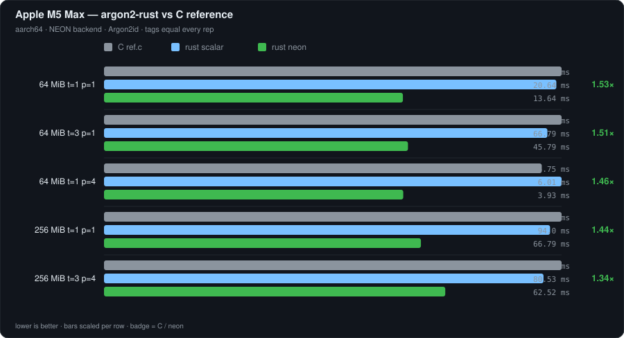
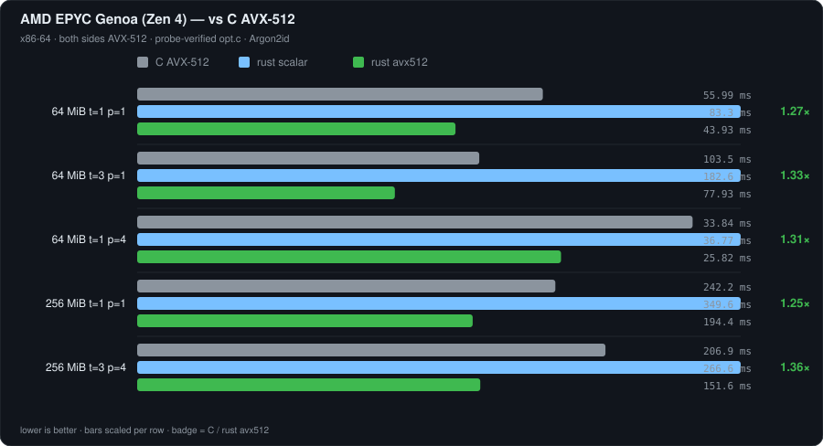
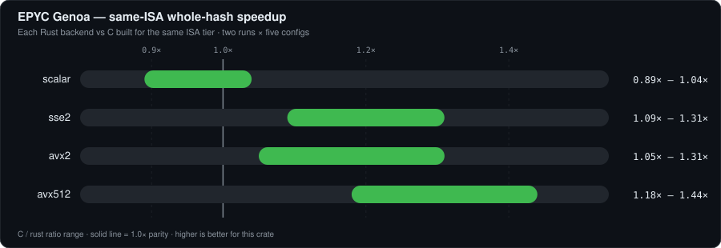
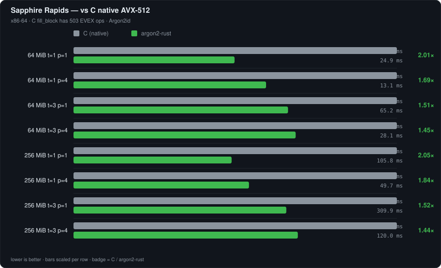
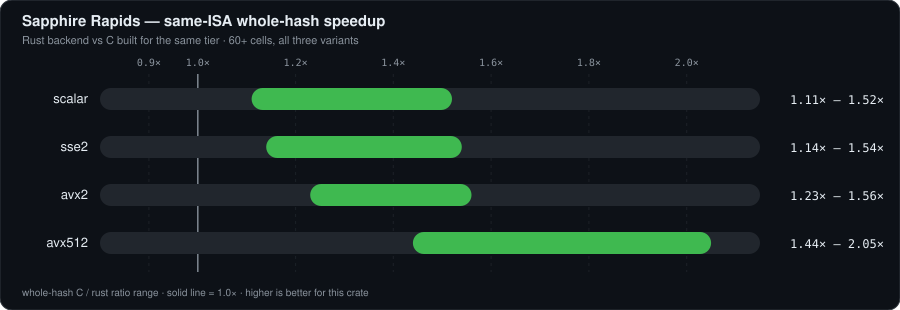
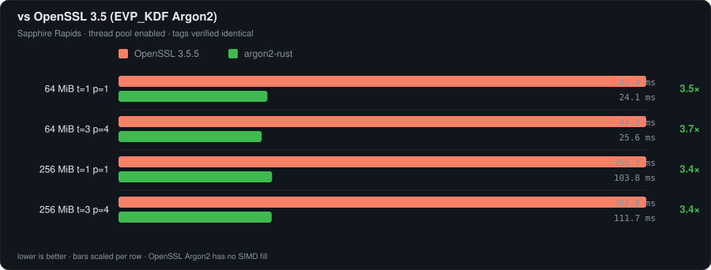
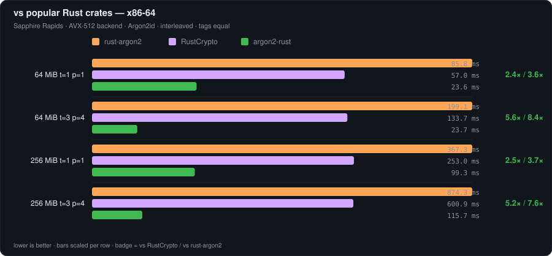
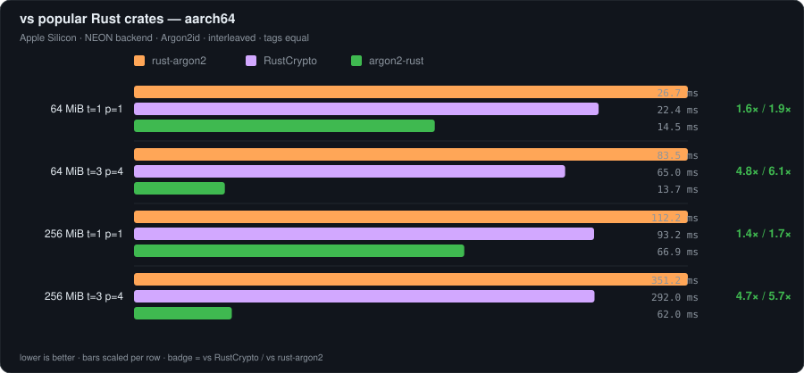

# argon2-rust

[](https://github.com/Brooooooklyn/argon2-rust/actions/workflows/ci.yml)
[](https://crates.io/crates/argon2-rust)
[](https://docs.rs/argon2-rust)
[](https://app.codspeed.io/Brooooooklyn/argon2-rust?utm_source=badge)
[](#license)

A pure-Rust port of the reference [Argon2](https://github.com/P-H-C/phc-winner-argon2)
implementation (RFC 9106), with **runtime-dispatched SIMD** — faster than the
C reference, OpenSSL, and the popular Rust crates, on both x86-64 and aarch64.

- **`#![no_std]` + `alloc`**, one mandatory dependency (`memchr`, for PHC
  field scans). Salt generation still talks to the OS with no extra crate
- **Bit-exact with the C reference for Argon2 versions 16 and 19** — verified
  against the official KAT traces (12,304 lines of internal state per file),
  the official `test.c` vectors, and a live differential harness comparing tags
  and C error codes over the supported parameter matrix; PHC strings are
  checked against the reference vectors
- **Runtime CPU dispatch**: the Argon2 fill selects AVX-512 → AVX2 →
  SSE2(+SSSE3) → NEON → scalar, while PHC Base64 separately selects AVX2 →
  SSSE3 → NEON → scalar. Like `base64-simd`, the Base64 cascade deliberately
  tops out at AVX2, including on AVX-512 CPUs. Each choice is cached in one
  relaxed atomic; safe code can never reach an instruction set the CPU lacks.
  On wasm32 both have a **SIMD128** backend selected at compile time (`-C
  target-feature=+simd128`), the only sound choice for a wasm module
- **Persistent worker pool** for `lanes > 1` (3 thread spawns per hash instead
  of the C's 48), with a hand-rolled 0.6 µs barrier
- **OS-native memory**: `mmap` + `MADV_HUGEPAGE` arena on Linux, secure
  wipe with a compiler barrier that survives `-O3`, optional pooled arena
  reuse across hashes
- **Full API**: raw hash, PHC encode/decode, verify, d/i/id × v0x10/v0x13,
  password-flavored aliases, the C error-code range (`-1..-35`), plus one
  crate-specific `-100` for OS-entropy failure
- **Salt generation without a dependency**: `hash_password_with_random_salt`
  reads the OS CSPRNG through the right entry point per platform
  (`getrandom(2)`, `getentropy`, `CCRandomGenerateBytes`, `ProcessPrng`, WASI
  preview-1 `random_get`, `/dev/urandom`), each declared by hand. Targets with
  no known source return `Error::OsRandom` rather than failing the build

## Security and audit status

This crate implements security-sensitive cryptographic code and has **not yet
received an independent third-party security audit**. Its differential tests,
official test vectors, sanitizers, Miri checks, and fuzzing provide useful
assurance, but are not a substitute for an audit. Evaluate it against your
threat model before deploying it in security-critical systems.

Please report suspected vulnerabilities privately as described in the
[security policy](SECURITY.md). Do not disclose security-sensitive details in a
public issue.

## Performance

All numbers are wall-clock medians, interleaved rep-by-rep so machine drift
hits both arms equally, with **tag equality asserted on every repetition**.
Lower is better for the ms columns; bigger is better for speedups.

### vs the C reference (`phc-winner-argon2`)

Measured on three hosts. Every C library is identified by **disassembling its
`fill_block` symbol**, never by the `OPTTARGET` that was typed — see
[Reading the C build](#reading-the-c-build).

| host | CPU | cores used | memory | OS / kernel | C compiler |
|---|---|---|---|---|---|
| **M5 Max** | Apple M5 Max, 12P + 6E | 1 and 4 | 128 GiB | macOS 26.5.2 | Apple `cc`, `-O3` |
| **EPYC Genoa** | AMD EPYC (family 25, model 17 = Zen 4), 2.55 GHz, 1 MiB L2/core | 4 vCPU | 12.5 GiB | Cloudflare Containers `standard-4`, Firecracker `6.18.36` | gcc 11.4.0, `-O3` |
| **Sapphire Rapids** | Intel, `c3-standard-4`, 105 MiB L3 | 4 vCPU | — | GCE | gcc, `-O3` |

Rust is `rustc 1.97.1` everywhere, bench profile (`opt-level=3`, `lto="thin"`,
`codegen-units=1`). Argon2id, tags asserted equal on every repetition.

#### Apple M5 Max — aarch64, NEON backend

The reference has **no NEON path**: `src/opt.c` is x86-only, so the Makefile
compiles `src/ref.c`. Both sides were disassembled rather than assumed:

| `fill_block` | instructions | SIMD mnemonics | vector-register operands |
|---|---:|---:|---:|
| C `ref.c` | 473 | **0** | **0** |
| Rust `Backend::Scalar` | 1141 | **198** | **588** |

**Neither row below is scalar-vs-scalar.** NEON is mandatory baseline on
aarch64, so LLVM auto-vectorises the Rust portable path — 192 of those SIMD
mnemonics are `eor.16b`, and the prologue saves `d15`/`d14` — while gcc leaves
`ref.c` entirely on general-purpose registers. The `scalar` row is therefore
*auto-vectorised portable Rust* against *non-vectorised portable C*, and it comes
out a tie, so LLVM's automatic vectorisation is worth approximately nothing here.
Everything below a tie is the hand-written NEON backend.

A true scalar-vs-scalar row is not reachable on this platform, and a
NEON-vs-NEON row does not exist at all, because the reference has no NEON
implementation to compare against. The x86-64 host below is the only place in
this README where Rust SIMD is measured against C SIMD.



<details>
<summary>Raw numbers</summary>

| config | rust scalar | rust neon | C `ref.c` | C / neon | C / scalar |
|---|---:|---:|---:|---:|---:|
| 64 MiB, t=1, p=1 | 20.64 ms | **13.64 ms** | 20.88 ms | **1.53x** | 1.01x |
| 64 MiB, t=3, p=1 | 66.79 ms | **45.79 ms** | 68.93 ms | **1.51x** | 1.03x |
| 64 MiB, t=1, p=4 | 6.01 ms | **3.93 ms** | 5.75 ms | **1.46x** | 0.96x |
| 256 MiB, t=1, p=1 | 94.00 ms | **66.79 ms** | 96.43 ms | **1.44x** | 1.03x |
| 256 MiB, t=3, p=4 | 80.53 ms | **62.52 ms** | 83.84 ms | **1.34x** | 1.04x |

</details>

The port costs nothing against the C it is a port of (0.96x – 1.04x). NEON adds
1.34x – 1.53x on top.

These NEON numbers depend on **FEAT_SHA3**. `fill_segment` compiles to 992
`xar.2d` here — the rotate-and-XOR instruction, which folds a rotation and an
XOR into one op and is exactly what BLAKE2's round wants. `rustc` enables `sha3`
for `aarch64-apple-darwin` but **not** for `aarch64-unknown-linux-gnu`, so a
generic aarch64 Linux build lowers those rotations another way and should not be
assumed to reach these ratios. See `src/fill_block/neon.rs` — `ROR32_DEFAULT`
picks the spelling by `cfg(target_feature = "sha3")`.

#### AMD EPYC Genoa (Zen 4) — x86-64, AVX-512 backend

The hardest comparison available: the reference ships hand-written AVX-512
intrinsics, and this CPU runs them. C built in-place with the reference's own
default `OPTTARGET=native`; the probe confirms `src/opt.c, avx512, fill_block
3497 B: evex=498 pmuludq=32`.



<details>
<summary>Raw numbers</summary>

| config | rust scalar | rust avx512 | C AVX-512 | C / rust |
|---|---:|---:|---:|---:|
| 64 MiB, t=1, p=1 | 83.30 ms | **43.93 ms** | 55.99 ms | **1.27x** |
| 64 MiB, t=3, p=1 | 182.55 ms | **77.93 ms** | 103.47 ms | **1.33x** |
| 64 MiB, t=1, p=4 | 36.77 ms | **25.82 ms** | 33.84 ms | **1.31x** |
| 256 MiB, t=1, p=1 | 349.63 ms | **194.38 ms** | 242.24 ms | **1.25x** |
| 256 MiB, t=3, p=4 | 266.63 ms | **151.59 ms** | 206.89 ms | **1.36x** |

</details>

Five independent runs on this host — against an explicitly-flagged
`-mavx512f -mavx512bw -mavx512dq -mavx512vl` build and against `-march=native` —
put the ratio at 1.17x – 1.49x, with no run disagreeing about the direction.
Generic vs `znver3` tuning made no difference beyond noise.

Note that `gcc -march=native` is worth checking rather than trusting here: gcc
11.4 predates Zen 4, so it reports `-march=znver3`, yet the probe still finds
`evex=498`. Native detection enables the CPUID feature bits regardless and only
falls back for *tuning*. The instruction counts settle it; the flag name does not.

Every Rust backend was also timed against the C built at the **same** ISA tier,
interleaved rep-by-rep, two independent runs over the five configurations
(`ARGON2_BENCH_SUMMARY_BACKEND` selects the Rust arm so the pair matches):



<details>
<summary>Raw numbers</summary>

| Rust backend | C build (probe-verified) | whole-hash range |
|---|---|---|
| scalar | `ref.c`, auto-vectorised to SSE2 | **0.89x – 1.04x** |
| sse2 | `opt.c` SSE2, `vex256=14` | **1.09x – 1.31x** |
| avx2 | `opt.c` AVX2, `vex256=288` | **1.05x – 1.31x** |
| avx512 | `opt.c` AVX-512, `evex=496` | **1.18x – 1.44x** |

</details>

The `scalar` row is the honest loss: `ref.c` at the x86-64 baseline is **not**
scalar, because the compiler auto-vectorises it to SSE2, so `Backend::Scalar`
is a portable fallback racing vectorised C and loses by up to 11%.

That table doubles as its own noise check. Timing `scalar` against `scalar` puts
the same code in both columns, and the ratio came back 0.98x – 1.02x, so this
method resolves about ±2% on this host. Ratios below that are not differences.

#### Sapphire Rapids — x86-64, AVX-512 backend

C built with its own `-march=native` — its `fill_block` contains 503 AVX-512
EVEX instructions, so this is the best the C can do on this machine.



<details>
<summary>Raw numbers</summary>

| config | C (native AVX-512) | argon2-rust | speedup |
|---|---:|---:|---:|
| 64 MiB, t=1, p=1 | 50.0 ms | 24.9 ms | **2.01x** |
| 64 MiB, t=1, p=4 | 22.0 ms | 13.1 ms | **1.69x** |
| 64 MiB, t=3, p=1 | 98.3 ms | 65.2 ms | **1.51x** |
| 64 MiB, t=3, p=4 | 40.9 ms | 28.1 ms | **1.45x** |
| 256 MiB, t=1, p=1 | 216.4 ms | 105.8 ms | **2.05x** |
| 256 MiB, t=1, p=4 | 91.6 ms | 49.7 ms | **1.84x** |
| 256 MiB, t=3, p=1 | 471.0 ms | 309.9 ms | **1.52x** |
| 256 MiB, t=3, p=4 | 173.0 ms | 120.0 ms | **1.44x** |

</details>

Every reachable path wins — each Rust backend was also compared against the C
built for the *same* ISA tier (60+ cells, all three variants):



<details>
<summary>Raw numbers</summary>

| Rust backend | C build | whole-hash range | fill kernel only |
|---|---|---|---|
| scalar | `ref.c` (gcc auto-vectorized to AVX2) | 1.11x – 1.52x | 1.00x – 1.10x |
| sse2 | `opt.c` SSE2 / SSSE3 | 1.14x – 1.54x | 1.03x – 1.19x |
| avx2 | `opt.c` AVX2 | 1.23x – 1.56x | 1.09x – 1.13x |
| avx512 | `opt.c` AVX-512 | 1.44x – 2.05x | 1.16x – 1.28x |

</details>

The fill-kernel win comes from a fully-unrolled round schedule (823 → 574
dynamic instructions per block) plus software prefetch of the reference block
on the data-independent path. The fixed-cost win (2.6x – 7.6x) comes from the
`mmap`+hugepage arena and the persistent worker pool — the C pays malloc,
page faults, and 48 `pthread_create`/`join` cycles per hash at t=3, p=4;
this crate pays one `mmap` and 3 spawns.

#### Reading the C build

A comparison against "the C reference" means nothing until you know which C got
compiled. `OPTTARGET` is not that answer: the Makefile silently falls back to
`src/ref.c` when the `-march` probe fails, and `ref.c` at the x86-64 baseline is
auto-vectorised to SSE2 anyway. So the label is never typed — it is read out of
the binary. `benches/support/cref_isa.rs` finds the `fill_block` symbol and
counts EVEX prefixes, `VEX.L=1` prefixes and `pshufb`, and prints the counts
next to the label so the classification can be checked instead of trusted:

```text
C reference : .../libargon2.so.1 (src/opt.c, avx512, fill_block 3497 B:
              evex=498 vex256=1 pshufb=0 pmuludq=32)
```

`pmuludq=32` is the tell for `opt.c` — two per BLAKE2 round, sixteen rounds. An
auto-vectorised `ref.c` emits many more.

#### Does loading the C through `dlopen` bias it?

No, and this was measured rather than argued. The bench loads the reference with
`dlopen` instead of linking it, and the Makefile compiles the shared library with
`-fPIC -fvisibility=hidden` while the static archive gets neither — so the `.so`
is genuinely different machine code, not just a different call path.

One self-timed C harness was built three ways from identical source and run
round-robin at process granularity, so drift hits all three equally:


<details>
<summary>Raw numbers</summary>

| link mode | M5 Max | EPYC Genoa |
|---|---:|---:|
| `libargon2.a`, direct call | 1.000x | 1.000x |
| `-largon2` shared, PLT | 0.990x – 0.998x | 0.978x – 1.012x |
| `dlopen`, as the bench does | 0.985x – 1.003x | 0.965x – 0.985x |

</details>

`dlopen` lands *faster* than static on most rows and the sign of the difference
flips between configurations, which is the signature of noise rather than a
systematic cost. There is nothing in a whole hash for linkage to charge except
one indirect call.

### vs OpenSSL 3.5 (EVP_KDF Argon2, thread pool enabled)

Sapphire Rapids, in-process `EVP_KDF_derive` timing, tags verified identical:



<details>
<summary>Raw numbers</summary>

| config | OpenSSL 3.5.5 | argon2-rust | speedup |
|---|---:|---:|---:|
| 64 MiB, t=1, p=1 | 85.4 ms | 24.1 ms | **3.5x** |
| 64 MiB, t=3, p=4 | 94.3 ms | 25.6 ms | **3.7x** |
| 256 MiB, t=1, p=1 | 356.7 ms | 103.8 ms | **3.4x** |
| 256 MiB, t=3, p=4 | 384.8 ms | 111.7 ms | **3.4x** |

</details>

(OpenSSL's Argon2 has no SIMD fill at all.)

### vs the popular Rust crates

The two most-downloaded Argon2 crates on crates.io —
[`argon2`](https://crates.io/crates/argon2) (RustCrypto, 41.6M downloads) and
[`rust-argon2`](https://crates.io/crates/rust-argon2) (19.7M downloads) —
interleaved, tags asserted identical, Argon2id:

**x86-64 (Sapphire Rapids, AVX-512 backend)**



<details>
<summary>Raw numbers</summary>

| config | argon2-rust | RustCrypto | rust-argon2 | vs RustCrypto | vs rust-argon2 |
|---|---:|---:|---:|---:|---:|
| 64 MiB, t=1, p=1 | 23.6 ms | 57.0 | 85.8 | **2.4x** | **3.6x** |
| 64 MiB, t=3, p=4 | 23.7 ms | 133.7 | 199.1 | **5.6x** | **8.4x** |
| 256 MiB, t=1, p=1 | 99.3 ms | 253.0 | 367.3 | **2.5x** | **3.7x** |
| 256 MiB, t=3, p=4 | 115.7 ms | 600.9 | 874.3 | **5.2x** | **7.6x** |

</details>

**aarch64 (Apple Silicon, NEON backend)**



<details>
<summary>Raw numbers</summary>

| config | argon2-rust | RustCrypto | rust-argon2 | vs RustCrypto | vs rust-argon2 |
|---|---:|---:|---:|---:|---:|
| 64 MiB, t=1, p=1 | 14.5 ms | 22.4 | 26.7 | **1.6x** | **1.9x** |
| 64 MiB, t=3, p=4 | 13.7 ms | 65.0 | 83.5 | **4.8x** | **6.1x** |
| 256 MiB, t=1, p=1 | 66.9 ms | 93.2 | 112.2 | **1.4x** | **1.7x** |
| 256 MiB, t=3, p=4 | 62.0 ms | 292.0 | 351.2 | **4.7x** | **5.7x** |

</details>

Both crates compute lanes sequentially even at `p > 1`, so the margin grows
with parallelism; the single-thread rows are the honest kernel-vs-kernel
comparison.

## Quick start

```toml
[dependencies]
argon2-rust = "1"
```

```rust
use argon2_rust::params::{Memory, TagLen};
use argon2_rust::{Algorithm, Argon2, Params, Version};

// Every setter is optional; unset ones keep `Params::DEFAULT`'s value.
let params = Params::builder()
    .memory(Memory::mib(64))
    .passes(3)
    .lanes(4)
    .tag_len(TagLen::bytes(32))
    .build()?;
let argon2 = Argon2::new(Algorithm::Argon2id, Version::V0x13, params);

let mut tag = [0u8; 32];
argon2.hash_into(b"password", b"random salt 16B!", &mut tag)?;

// PHC string format
let encoded = argon2.hash_encoded(b"password", b"random salt 16B!")?;
assert!(Argon2::verify_encoded(&encoded, b"password", Algorithm::Argon2id).is_ok());

// Or let the crate draw a fresh 16-byte salt from the OS:
let encoded = argon2.hash_password_with_random_salt(b"password")?;
```

Verifying a string you did not write? `m_cost` is ten digits of attacker-chosen
decimal, and — exactly as in the C — nothing stands between it and the
allocation, all 4 TiB of it. Bound it:

```rust
// No stored hash should exceed this.
let ceiling = Params::builder()
    .memory(Memory::mib(64))
    .passes(8)
    .lanes(4)
    .tag_len(TagLen::bytes(32))
    .build()?;
Argon2::verify_encoded_bounded(&encoded, b"password", Algorithm::Argon2id, &ceiling)?;
```

That bounds the *allocation*, not just the cost numbers: the length of the
string is checked against what the ceiling could have produced before the
decoder runs, since the decoder sizes its salt and tag buffers from the input.
`_with_ad` and pooled `Hasher` spellings exist too.

Memory is not the only resource `p` spends. Decoding sets `threads = lanes`, so
the string also picks how many OS threads the verify spawns — which
`ceiling.threads()` bounds. Leaving `.threads()` unset makes it track `.lanes()`,
so the ceiling above caps both together at 4; set `.threads(1)` on the builder to
accept wide strings without spawning wide. Clamping never changes a verdict: only
`lanes` feeds the tag.

Hashing many passwords? Pool the arena — one allocation total instead of one
per hash:

```rust
let mut hasher = argon2.hasher();
for (pwd, salt) in &credentials {
    let mut tag = [0u8; 32];
    hasher.hash_into(pwd, salt, &mut tag)?;
}
```

## How the dispatch works

```
                     first hash in the process
                              │
                    is_*_feature_detected! cascade
        ┌──────────┬────────┬─────────┬────────┬────────┐
        ▼          ▼        ▼         ▼        ▼        ▼
      AVX-512 →  AVX2  →  SSE2  →   NEON  → scalar   (cached in one AtomicU8)
        │    (SSSE3 probed separately at runtime)
        │    aarch64: NEON is compile-time on Apple/Windows (measured
        │    fastest there); other aarch64 hosts run a one-time ~4 ms
        │    shootout — Neoverse N1 gets scalar, Apple-class cores NEON
        │    wasm32: SIMD128 selected at compile time (1.5-1.6x over
        │    scalar under wasmtime); on wasm32-wasip1-threads the worker
        │    pool runs for real — 3.9x from 4 lanes
        ▼
  one fn-pointer resolve per hash, one indirect call per *segment*
  (thousands of blocks) — dispatch cost is one relaxed atomic load
```

Safe API never names a backend, so safe code can never execute an instruction
the CPU lacks. Explicit-backend entry points exist for testing and are
`unsafe fn` (with `compile_fail` doctests proving the boundary).

## Feature flags

| feature | default | what it does |
|---|:---:|---|
| `std` | ✓ | runtime CPU detection (falls back to compile-time cfgs without it) |
| `parallel` | ✓ | multi-lane fill on the persistent worker pool |
| `zeroize-memory` | ✓ | wipe internal buffers (the C's `FLAG_clear_internal_memory`) |
| `bump-alloc` | | internal test/bench control for `Workspace`; does not change stable hashing paths |
| `internal-api` | | test/bench hooks (`__internal`); never enable in production |

`--no-default-features` builds for `no_std` (with `alloc`), including e.g.
`thumbv7em-none-eabi`.

## SemVer policy

From `1.0.0` onward this crate follows [Semantic
Versioning](https://semver.org/spec/v2.0.0.html):

- **Covered by SemVer:** the public API under default features — crate-root
  re-exports (`Argon2`, `Hasher`, `Params`, `Algorithm`, `Version`, `Error`,
  `Backend`, `Base64Backend`, `Blake2bBackend`, `Decoded`, `encode_base64`,
  `decode_base64`, `decode_phc`, `decode_string`, `encode_string`,
  `blake2b`, `blake2b_long`, `constant_time_eq`, …), the `params` and `error`
  modules, PHC encode/verify behaviour for supported versions, and the
  meaning of default features (`std`, `parallel`, `zeroize-memory`).
- **Not covered:** the `internal-api` feature and everything under
  `__internal` (explicitly unstable; may change in a patch).
- **MSRV** (`rust-version` in `Cargo.toml`) may rise on a **minor** release
  when a newer compiler is required for a documented reason (today: stabilized
  AVX-512 stdarch at 1.89). It does not rise in a patch solely to use newer
  language sugar.
- Optional features added later (for example a future `password-hash` trait
  façade) are non-breaking when they default off.

This is a pure-Rust port of the C reference with PHC string interop — not an
implementation of the RustCrypto `password-hash` traits. See the crate docs.

## C parser compatibility limits

The hash core is bit-exact for the two standard versions this crate represents,
and PHC strings emitted by this crate round-trip with the C reference. Its Rust
decoder differs from C on several inputs outside that ordinary surface:

- C accepts any numeric `$v=` value because its validator does not inspect the
  version. The raw value is hashed into H0, so C can produce and verify a
  self-consistent `$v=99` record. This crate's closed `Version` enum accepts
  only 16 and 19 and returns `DecodingFail` otherwise.
- C verification uses `strlen` and therefore ignores bytes after an embedded
  NUL. A Rust `&str` has an explicit length, so this crate requires the whole
  string to be consumed.
- The C decoder's input type is an arbitrary byte string, while Rust's `&str`
  boundary cannot represent malformed UTF-8. On targets where C `char` is
  signed, its decoder also misclassifies every byte `>= 0x80` in a Base64 field
  as `/`; this crate rejects valid non-ASCII UTF-8 and cannot receive malformed
  UTF-8.

These are parser-acceptance differences, not differences in Argon2 tags for
supported versions and canonical ASCII PHC strings.

## Verification

The test suite proves equivalence with the C rather than assuming it:

- **Golden traces**: all six official KAT files replayed block-by-block
  (12,304 lines of internal memory state each), per runnable backend
- **Official vectors**: every `hashtest()` call from `test.c`, plus
  error-state parity (same numeric codes, same messages)
- **Live differential**: ~1,300 randomized parameter sets hashed by both this
  crate and the compiled C reference in one process; tags *and* error codes
  must match exactly
- **Reuse/audit**: pooled-arena byte-identity with one-shot hashing, an
  allocator spy proving wipe-before-free, and RSS isolation checks

## Reproducing the benchmarks

```console
# Full criterion suite (vs C via dlopen, per-backend grid)
cargo bench --features internal-api

# Seconds-scale iteration harness
cargo bench --bench micro --features internal-api -- \
    --backend avx512 --m 262144 --t 3 --p 4 --vs-c
```

`--vs-c` loads `phc-winner-argon2/libargon2.so.1` (built with its own
`make`) at runtime, prints the ISA genuinely inside it, and asserts tag
equality every repetition.

Build the reference first, and pin the ISA rather than trusting `native`:

```console
make -C phc-winner-argon2 clean
make -C phc-winner-argon2 OPTTARGET=native libs                    # best on this CPU
make -C phc-winner-argon2 OPTTARGET='x86-64 -mavx2' libs           # pinned AVX2
make -C phc-winner-argon2 OPTTARGET=none libs                      # ref.c
```

Then check the probe line in the output before quoting any ratio. On aarch64
every `OPTTARGET` produces `src/ref.c`, because `src/opt.c` is x86-only.

For a *matched* row, pin the Rust arm to the same ISA as the C. Detection always
returns the best backend, so on an AVX-512 host the ratio table would otherwise
only ever compare `avx512`:

```console
# rust avx2 vs an AVX2 C, interleaved; skips the criterion groups
ARGON2_BENCH_SUMMARY_BACKEND=avx2 ARGON2_BENCH_REUSE_ONLY=__none__ \
    cargo bench --bench argon2 -- __no_such_group__
```

Point it at a backend the CPU cannot execute and it says so and falls back,
rather than crashing or silently running something else.

The x86-64 numbers above were taken by cross-building the bench binaries with
`cargo zigbuild --target x86_64-unknown-linux-gnu.2.35 --release --benches` and
running them in a container, with the C compiled by gcc on the target itself.
The bench bakes the reference's path at compile time from
`env!("CARGO_MANIFEST_DIR")`, so the tree must sit at the same absolute path
when it runs as when it was built.

### Continuous benchmarking

Every push and pull request runs `benches/codspeed.rs` under
[CodSpeed](https://app.codspeed.io/Brooooooklyn/argon2-rust)'s CPU simulation
instrument, which counts instructions, cache accesses and branches inside a CPU
model rather than timing a shared runner. That is a different question from the
tables above — it is a *regression net*, not a speed claim — so the suite is
deliberately small, single-threaded and public-API focused: the three Argon2
algorithms plus the one-shot and reusable-hasher hashing, keyed, encoding, and
verification paths.

```console
cargo codspeed build --bench codspeed
cargo codspeed run --bench codspeed
```

## License

Licensed under the [MIT License](LICENSE).

This crate is a port of the [Argon2 reference
implementation](https://github.com/P-H-C/phc-winner-argon2) by Daniel Dinu,
Dmitry Khovratovich, Jean-Philippe Aumasson, and Samuel Neves, which is offered
under CC0-1.0 or Apache-2.0 at the user's option. The port is made under the
CC0-1.0 option — a public-domain dedication that places no conditions on
derivative works — which is what permits this crate to be MIT-licensed. See
[NOTICE](NOTICE).
