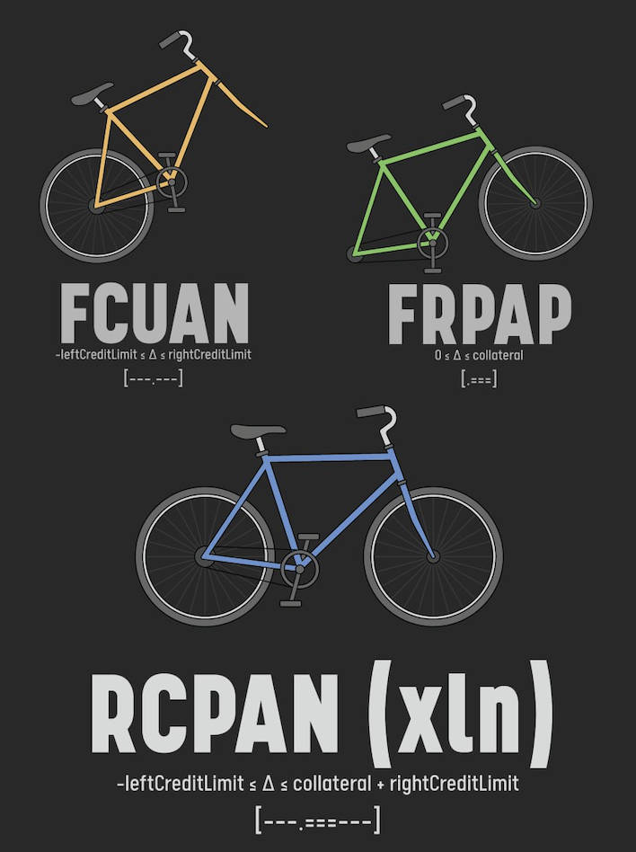
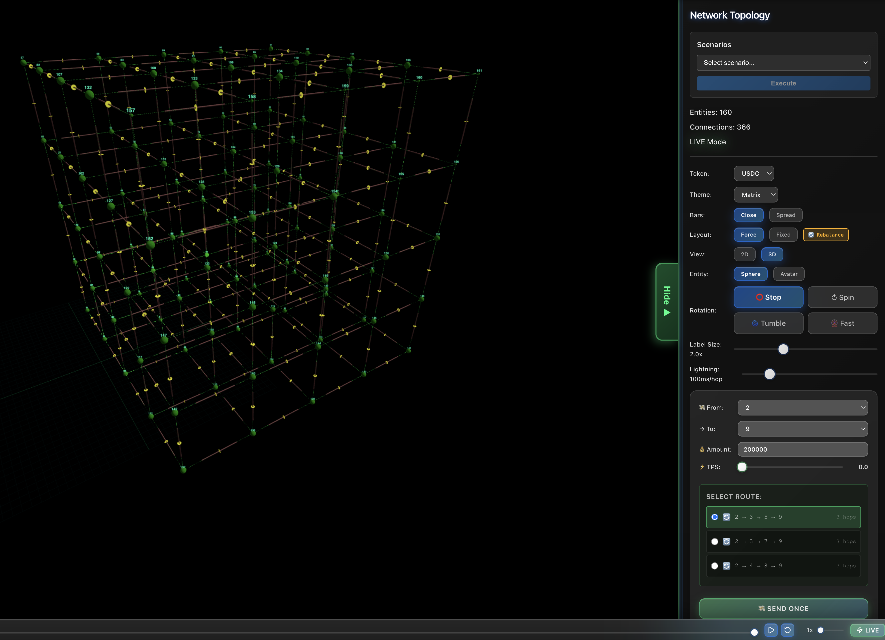

# 1.0 Unified Financial Theory DRAFT

RCPAN ⊇ FCUAN+FRPAP `−Lₗ ≤ Δ ≤ C + Lᵣ`

### Egor Homakov / h@xln.finance

# Questions & Answers

### whoami

Before we jump to Abstract, lets briefly elaborate my **intrinsic motivation and passion** to creating UFT/Xln. I started my career in JavaScript/Ruby on Rails software engineering circa 2007.

In 2012, I've stumbled upon a fundamental insecure-by-default pattern in Rails called mass assignment and inappropriately hacked Github to make my point. Ever since I was obsessed with finding not just one-off bugs, but systemic issues in protocols and improving software layers as a whole: further hardening Ruby-ecosystem, client side security, OAuth2.

I founded [Sakurity](https://sakurity.com), conducted boutique security audits for some of the big names in the startup industry. Things went good. Around 2017 I've decided to retire from audits and focus on **the most critical yet most vulnerable and misdesigned architecture on the planet** – our financial system, including TradFi + DeFi (according to JEA soon you will see why they are two parts of the whole).

The catalyst was reading the Lightning Network whitepaper and realizing: the authors (Joseph Poon, Thaddeus Dryja) invented the genius primitives, **"the wheel"** (proofs + collateral + delta transformer) but then tried to apply it in an obviously delusional way, **"the unicycle"** (full-reserve account network, has no working incentive model, can't scale). By 2026 it's crystal clear I was right: Lightning/Raiden/Hydra and all other full-reserve inspired channel networks are dead due to inbound capacity problem.



The solution to inbound capacity was painfully obvious: **credit is all you need**. This is when the core of Xln was formed: molding together the most scalable & universally understood Unicast full-credit architecture (custodial/banking/CEX network of accounts) with the most secure but misunderstood Layer2 technology (full-reserve payment/state channels). The RCPAN invariant `−Lₗ ≤ Δ ≤ C + Lᵣ` was born on Aug 24, 2017. This is the core formula, around of which further layers are built upon.

The UFT (theory) and Xln (practical reference implementation) is my magnum opus and quintessence of 9 years of research into TradFi/RTGS/DeFi/DAO/AA/institutional governance/state channels. I believe it's 100x more important than all of my infosec research combined. Call me delusional, but I just happen to be right, eventually.

### Another Bitcoin/Ethereum Killer?

**No, quite the opposite! Xln is not a blockchain, it's a unified Layer2 for all Jurisdiction machines.**

We believe and double down on the original vision of Bitcoin and Ethereum where every laptop and phone can run fully verifying node. 

Xln achieves that by creating two loosely coupled layers: 

* <30-100 tps global settlement Layer1 (Bitcoin and Ethereum are J-machines). Xln is jurisdiction-agnostic and can support any L1, but the lower global tps - the easier it is to run a full node on consumer device. Xln is the first architecture that works just fine with Original Ethereum, even if gaslimit is reduced 10-100x. Unlike rollups, Xln does not require blobspace or data availability committees of any form - the account proofs are sovereign and exits are guaranteed at all times.
* unbounded scalability Unicast Layer2. Xln is a netting overlay attaching to any EVM L1/EVM-rollup/future EVM-like CBDC J-machines, creating financial Internet of unified liquidity.

### Show, don't tell!

You are absolutely right! You can build & play with your personal home-grown credit-collateral subnet xlnomy at xln.finance in 2D/Graph 3D/VR/Panel/Terminal interface. **It's real fun with Oculus Quest!** Create personal entities, N/M multifactor entities, hierarchical companies and institutions with instant IPO of C/D shares with any hub. Stream dividends and buybacks per-second, do merge&acquisitions, new board election, and of course borrow/lend/payments/swaps and other DeFi primitives of any complexity. 



Private testnet with cross-subnet networking ETA: Q1 2026.

### Should I read it? What's target audience?

Anyone, really. Especially if you're into fintech/crypto/complex systems. If you're willing to bend your mental models around the status quo, embrace our contrarian yet factually correct rhetoric, ready to research into unknown and question the dogmas from first principles - yes.

If you don't have time for 30-60 min deep reading - **spend 5 minutes on understanding core RCPAN invariant** and save the rest of the document for the future. 

### How to read it

The documents are a little heavy on technical & financial terminology. This is intentional - instead of making it a tedious long read "for the general crowd", it seemed like a better idea to make it concentrated and to the point, letting readers ask an LLM of their choice to re-hydrate expand on any paragraph, with targeted prompts like "ELI5?", "I'm a banker, what is it?", "I'm a protocols engineer, what's under the hood?".

There will be more approachable and elaborated versions of it soon. You're welcome to create your own adaptaion, though!

**Start with "context: https://xln.finance/c.txt should I learn it and why?" with any frontier language model.** GPT-5/Claude/Grok/Gemini/Qwen/GLM – all have phenomenal grasp on UFT/Xln once you attach the whitepapers/contracts/src as the context.

Feel free to reach out directly if after 3-5 prompts the answers still seem cryptic to you. 

# Abstract

In this flagship whitepaper we propose a series of incremental upgrades and simplifications to the status-quo mental model of how financial & organizational double-layered networks work and reasoned about. 

Unified Financial Theory (UFT) naturally integrates or solves at its core some of the most popular and long-standing monetary theories, including but not limited to:

* **Board/Control/Dividend shares** - many companies use Class A/B shares with rigid 1:10 ratio of Dividend-shares (Economical) to Control-shares (Governance). We suggest to decouple them completely into Board shares (immediate executive power over an entity, non-transferrable), Control shares (publicly tradeable tokens, configurable 51%+ quorum can elect a new Board) and Dividend shares (publicly tradeable tokens that are subject to dividends or buybacks). 

* **Algorithmic Index Funds** - in additional to classic index funds (such as Vanguard/BlackRock/StateStreet-ran in TradFi) which are tradeable through a proxy entity and bleed enormous rent-seeker fees, UFT allows personal programmable indexes in-wallet with automatic rebalances. Sovereign nature 

* *The Quantity Theory of Value* - for centuries population was fooled by inflation, when a controlling party unilaterally increased supply of a fungible token. Not just fiat tokens are subject to this, even securities/shares can inflated by the majority decision, effectively stealing the value from the minority holders. We suggest to optionally cement a fixed (e.g. 100T) supply for all Control/Dividend shares for newly formed entities, establishing long term fairness axiom between the majority and minority shareholders. 

* **All Deposit Insurance Schemes (DIS) are Underfunded and Morally Hazardous** - we sidestep the fundamental underfunded flaw (<1% of M2) of DIS schemes by shifting them from industry-forced to private & strictly optional open insurance & reinsurance markets. DIS all over the planet never were and never will be a sound solution due to their "shared pot" morally hazardous architecture.  . It's merely a double-layered smoke-screen to first pockets of commercial bank clients (through quarterly premiums paid by banks to DIS) and then straight to pockets of taxpayers (any "too-big-to-fail" top20 ) and cosmetic "calm-down" figure.

* **The Coase theorem** - Unicast and permisionless nature of Xln allows transactional fees to race to the bottom: absolute zero or even negative (for auto-rebalancing of cross-hub accounts), allowing first truly frictionless Coasian xlnomy. This never was and never will be feasible with Broadcast O(n) design of big-blocker/sharding/rollups – no matter how optimized/parallelized their software or blobspace is overfloated and DAC trust assumptions increased – making Xln simply impossible to compete with in terms of speed and transactional cost.

* **The "Diamond-Dybvig hub run problem"** – cannot be solved completely as long as counterparty risk exists, but greatly alleviated and contained in Xln. By giving the hub (banks+brokers+CEX superset) and its spokes (all users, companies and institutions connecting to the hubs) a new way to cryptographically dispute bilateral accounts, keep guaranteed 2-of-2 escrow collateral and enforce debts over the collateral limit (see enforceDebt() in Depository.sol), we achieve faster and more seamless way to pull liquidity both from the hub to its "libaility" spokes and from the hub's "asset" spokes to the hub. We believe that eventually total counterparty risk will be reduced to ~1-10% of what is currently exposed with unprovable & franctional reserve model.

In parallel, we suggest a practical reference implementation of the theory: extensible layered network (xln): world's first financial substrate that is both most scalable, most secure and mentally simple at the same time.

This way Xln solves Coase theorem by reaching an absolute theoretical minimum of transactional costs. 

Infinite Unicast O(1) scalability: 1,000,000,000+ tps - same as the underlying Internet. Xln is a netting-account layer, same as banking/ACH, where only net collateral settlements and disputes between entities reach the broadcast J-machine level, keeping 99.99% of value transfers private, instant and practically free.

Xln is also unprecedently secure: while every other Broadcast O(n) architecture (big-blockers/sharding/rollups) have long forgoten the maxima "full node on every laptop", RCPAN allows each and every consumer device will be a fully-verifying node of underlying Jurisdiction-machines (with current focus on EVM J-machines: all public EVM chains and future CBDCs)

We will go carefully and incrementally, explaining the rationale & solutions layer by layer. We avoid any practical innovation in the first two chapters. 

In the first chapter we focus exclusively on reducing the overengineered and incomprehendable terminology of both TradFi and DeFi into sound and elegant hierarchical replicated state machine (HRSM) tri-layer: Jurisdictions - Entities - Accounts (JEA). Any financial system under the sun can be expressed in JEA terms. 

In second chapter we generalize all world's financial Unicast systems into two major categories: full-credit unprovable account networks (FCUAN: all banking, brokers and CEX) and full-reserve provable account networks (FRPAN: Lightning/Raiden/Hydra/other channel networks).

In third chapter, we introduce our main innovation, the superset invariant **reserve-credit provable account network RCPAN ⊇ FCUAN+FRPAP**

`−Lₗ ≤ Δ ≤ C + Lᵣ`

xln is the first RCPAN (Reserve-Credit, Provable Account Network): credit where it scales, collateral where it secures—a principled hybrid of FCUAN and FRPAP.

```
FCUAN invariant:
−leftCreditLimit ≤ Δ ≤ rightCreditLimit
[---.---]

FRPAP invariant:
0 ≤ Δ ≤ collateral
[.===]

RCPAN (xln) superset invariant:
−leftCreditLimit ≤ Δ ≤ collateral + rightCreditLimit
[---.===---]
```

Additional whitepapers that further complement UFT are published separately:

* **2.0 Cascade Security Model**: we extend the credit+collateral RCPAN invariant with "on-jurisdiction reserves" and opt-in Deposit Insurance Schemes forming a waterfall-like security cascade for all fungible value any entity in Xln holds: reserve->collateral->credit->insurance->reinsurance. 

* **3.0 Delta Transformers**: generalized way to Bilateral Unicast DeFi: programmable cascade of hooks `int[] deltas -> Transformer.apply(data, leftArguments, rightArguments) -> int[] deltas` that entities simulate off-J but can routinely enforce with Depository.sol during on-J dispute. Transformers allow Lego-DeFi logic of any complexity but in bilateral 2-party fashion (same as how TradFi worked for centuries).

* **4.0 Cascade Control Model**: a deeper dive into Board/Control/Dividend cascade, a novel hierarchical aggregated Hanko-signature for Entity-machines and Merge&Acquisition, index funds and institutional mechanics of Xln. 

* **5.0 BrainVault**: argon2id(username, password, complexityFactor ~5sec...5hours) - in addition to cumbersome randomly generated 16-word seeds users may prefer the longer but easier to handle option. Just like RCPAN accounts are "payment channels done right" we propose a secure evolution of BrainWallet/WarpWallet idea.


[1.1 Jurisdiction Machine](11_Jurisdiction_Machine.md)


