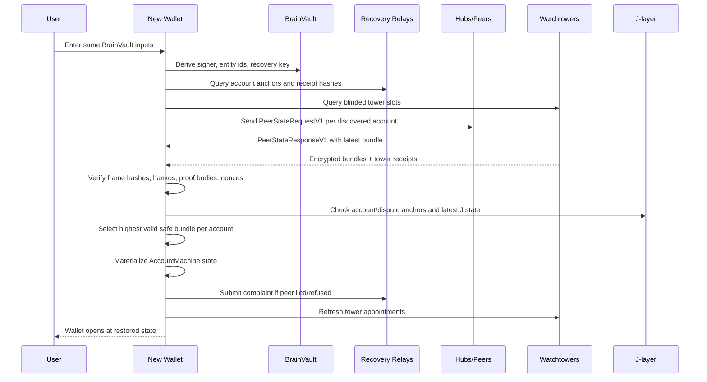

# XLN Recovery and Watchtower Protocol

Status: protocol spec and implementation tracker, updated for `0.1.5`
Scope: account-state recovery, peer refresh, watchtower storage, and offline dispute protection
Audience: runtime, wallet, hub, relay, and protocol implementers

## Executive Summary

BrainVault can restore the user's keys on a new computer, but it cannot restore bilateral account state by itself. XLN needs a recovery layer that makes a fresh install converge back to the user's latest safe state with no manual backup ceremony.

The protocol should have three layers:

1. **Peer State Refresh (PSR)**: the wallet periodically asks every known counterparty or hub for the latest signed account state. Honest hubs answer for free because it improves trust and Hub Matrix reputation.
2. **Recovery Relay**: a public, non-custodial evidence relay stores signed account-open anchors, state receipts, and complaints when a counterparty gives a stale/fake response or refuses to answer.
3. **Watchtower Vault**: a cheap or free service stores the last `K` compact encrypted recovery bundles per account, keyed by deterministic blinded slots. Advanced towers also monitor J-layer disputes and publish the user's latest valid proof when the user is offline.

The user flow must be: install wallet, enter the same BrainVault inputs, derive the same runtime identity, discover accounts, fetch peer/tower bundles, verify signatures locally, restore account machines, resume.

## Lightning Lessons

Lightning separates three concerns that XLN should also keep separate:

- **Key recovery is not channel-state recovery.** LND disaster recovery can restore seed-derived keys, but channel recovery needs static channel backup or the latest channel database. LND's static channel backup asks peers to force-close; it does not reconstruct arbitrary latest channel state locally.
- **Watchtowers are insurance, not cloud backup.** Lightning watchtowers store encrypted breach-remedy transactions and monitor the chain for revoked commitments. They act only when a bad old state appears.
- **Monitoring deadlines are part of the protocol.** BOLT #5 requires nodes to monitor chain spends and resolve outputs until they are irrevocably resolved. The tower exists because mobile/consumer nodes cannot be online continuously.
- **Privacy matters.** Lightning watchtowers see only trigger hints until a breach decrypts the remedy. XLN should preserve this property where practical.

Sources are listed at the end.

## Current XLN Fit

XLN already has most of the raw material:

- `AccountMachine.currentFrame`, `pendingFrame`, `currentHeight`, `currentFrameHanko`, and `counterpartyFrameHanko` in `runtime/types.ts`.
- Dispute proof state: `abiProofBody`, `currentDisputeProofHanko`, `counterpartyDisputeProofHanko`, `disputeProofNoncesByHash`, and `disputeProofBodiesByHash`.
- `buildAccountProofBody()` and `createDisputeProofHash()` in `runtime/proof-builder.ts`.
- durable account frame journal via `RuntimeFrameDbRecord` and `runtime/storage/frame-db.ts`.
- storage Merkle roots used by `stateHash`, documented in `docs/merkle.md`.
- `entity-crontab.ts` already handles pending-frame resend, stale pending-frame detection, HTLC timeouts, rollback suggestions, and rebalance automation.
- the native wallet plan already says relays/watchtowers may notify and prove, but must not hold spend-capable user keys.

Implemented in the current repo:

- same-origin official tower endpoint under `/api/tower/*`;
- standalone watchtower daemon with scheduled sweep;
- blind encrypted backup uploads and restore;
- encrypted delayed-last-resort remedies that decrypt only after the account
  `watchSeed` is revealed by `DisputeStarted`;
- HTTP and store rejection of plaintext last-resort remedies;
- public nginx exposure of `/api/watchtower/*` removed;
- guarded `watchtowerCounterDispute(...)` path that rejects early tower action,
  wrong tower action, missing newer proof, and same-proof delegated finalize;
- browser E2E for wiped-browser watchtower restore and post-restore channel
  payments.

Still missing or incomplete:

- first-class Peer State Refresh (PSR) wire flow;
- recovery relay account discovery and complaint/reputation flow;
- account-level recovery coverage UI;
- production monitoring/alerts for tower upload freshness and action receipts;
- mainnet operator policy for tower keys, gas, RPC allowlist, and backup drills.

## Goals

- A user can restore on a new computer by entering the same BrainVault inputs.
- The restored client never trusts a hub/tower blindly; every accepted state is verified against signed frames and dispute proofs.
- Honest hubs can restore state with one response per account.
- Towers store only compact bundles, default `K = 3` per account, with overwriting slots.
- Tower storage is privacy-preserving by default and can be free or very cheap.
- Advanced towers can act during dispute windows without any unrestricted spend key.
- The UI shows recovery coverage clearly without asking the user to understand protocol details.

## Non-goals

- Do not turn watchtowers into custodians.
- Do not make the tower a mandatory centralized service.
- Do not require the user to export files manually for normal recovery.
- Do not rely on a peer's unsigned JSON state.
- Do not let `clearDB` or local reset become an accidental funds-loss path.

## Protocol Layers

### Layer 0: BrainVault Identity

BrainVault restores deterministic wallet material from the same name, passphrase, and shard settings. That gives the wallet the same signer addresses and entity ids.

BrainVault does not restore:

- account lists,
- current account frame heights,
- proof bodies,
- pending frame state,
- settlement/dispute metadata,
- peer endpoints.

So after BrainVault unlock, the wallet enters **Recovery Discovery** rather than assuming a fresh empty runtime is safe.

### Layer 1: Account Discovery

At account opening, both sides create an `AccountOpenAnchorV1` and publish it to selected relays/towers:

```ts
type AccountOpenAnchorV1 = {
  version: 1;
  jurisdictionId: string;
  accountId: string;              // canonical H(leftEntity, rightEntity, jurisdiction)
  leftEntityId: string;
  rightEntityId: string;
  openedAtRuntimeHeight: number;
  openedAtJHeight: number;
  recoveryEndpoints: string[];    // relay, hub, tower, or direct endpoint URLs
  ownerRecoveryPubkey: string;    // derived from BrainVault recovery branch
  counterpartyRecoveryPubkey?: string;
  anchorHash: string;
  leftHanko?: string;
  rightHanko?: string;
};
```

The relay may store a public form or a blinded form:

```txt
public lookup:  entityId -> account anchors
blinded lookup: H("xln/recovery/discovery/v1" || recoveryPubkey || entityId)
```

For consumer UX, hubs should publish anchors automatically. Privacy-sensitive users can use blinded discovery plus local contact lists.

### Layer 2: Peer State Refresh

Peer State Refresh is the simple mechanism from the prompt: periodically ping existing accounts and ask for the latest state.

Request:

```ts
type PeerStateRequestV1 = {
  type: "peer_state_request";
  version: 1;
  requesterEntityId: string;
  accountId: string;
  knownHeight?: number;
  knownStateHash?: string;
  challenge: string;              // random 32 bytes
  requested: "latest" | "range" | "proof_only";
  requesterHanko: string;         // signs accountId + challenge + knownHeight
};
```

Response:

```ts
type PeerStateResponseV1 = {
  type: "peer_state_response";
  version: 1;
  responderEntityId: string;
  accountId: string;
  challenge: string;
  latestHeight: number;
  latestStateHash: string;
  bundle: AccountRecoveryBundleV1;
  responderHanko: string;         // signs response header + bundleHash
};
```

Rules:

- Hubs answer for free for accounts they service.
- A response is accepted only if the bundle verifies locally.
- A stale but signed response is not fatal if a tower has a higher valid bundle.
- A fake response is evidence for a complaint.
- A refusal or timeout lowers recovery reputation but does not prove fraud by itself.

Default cadence:

- active account: every 5 minutes;
- idle account: every 1 hour;
- archived account: every 24 hours;
- after every committed frame: immediate refresh/upload debounce, target under 2 seconds;
- after pending HTLC or dispute-related frame: immediate urgent upload.

### Layer 3: Recovery Relay

The relay is not a judge and does not custody state. It stores verifiable evidence:

```ts
type StateComplaintV1 = {
  type: "state_complaint";
  version: 1;
  complainantEntityId: string;
  accountId: string;
  challenge: string;
  accusedEntityId: string;
  accusedResponse?: PeerStateResponseV1;
  complainantBestBundle?: AccountRecoveryBundleV1;
  reason:
    | "invalid_signature"
    | "invalid_state_hash"
    | "stale_height"
    | "missing_dispute_proof"
    | "refused_latest"
    | "timeout";
  complaintHanko: string;
};
```

Relay outputs:

- signed receipt for complaint submission;
- public or blinded reputation event;
- optional gossip to other relays/towers;
- Hub Matrix score update.

The relay should not decide balances. It verifies cryptographic facts only: signatures, hashes, account id, and relative heights.

### Layer 4: Watchtower Vault

The Watchtower Vault stores compact recovery bundles. There are two modes.

**Blind backup mode**

- Tower stores encrypted bundles.
- Tower cannot read account balances or proof bodies.
- Tower returns bundles after a BrainVault-derived signed restore request.
- This solves new-device recovery and local disk loss.

**Last-resort disputer mode**

- Tower also receives a narrowly scoped dispute action payload.
- Tower monitors J-layer account/dispute events.
- If a stale proof/dispute appears, tower publishes the latest valid proof or alerts relays.
- Tower never receives spend-capable user keys.

## Account Recovery Bundle

The recovery bundle is the core object. It must be compact, self-verifying, and sufficient to restore or defend one account.

```ts
type AccountRecoveryBundleV1 = {
  version: 1;

  account: {
    accountId: string;
    jurisdictionId: string;
    leftEntityId: string;
    rightEntityId: string;
    ownerEntityId: string;
    counterpartyEntityId: string;
  };

  latestCommitted: {
    height: number;
    frame: AccountFrame;
    frameHash: string;            // equals frame.stateHash
    ownerFrameHanko: string;
    counterpartyFrameHanko: string;
    committedAtRuntimeHeight?: number;
    committedAtJHeight?: number;
  };

  dispute: {
    proofBodyHash: string;
    encodedProofBody?: string;    // needed for active tower or full restore
    proofBodyStruct?: unknown;    // matches runtime disputeProofBodiesByHash
    disputeHash: string;
    nonce: number;
    ownerDisputeHanko: string;
    counterpartyDisputeHanko: string;
    depositoryAddress: string;
    disputeConfig: {
      leftDisputeDelay: number;
      rightDisputeDelay: number;
    };
  };

  stateMaterial: {
    deltas: Array<[number, Delta]>;
    locks?: Array<[string, HtlcLock]>;
    swapOffers?: Array<[string, SwapOffer]>;
    pulls?: Array<[string, PullCommitment]>;
    settlementWorkspace?: SettlementWorkspace;
    lastOutboundFrameAck?: AccountMachine["lastOutboundFrameAck"];
  };

  pending?: {
    pendingFrame?: AccountFrame;
    pendingAccountInput?: AccountInput;
    createdAt: number;
    reason: "awaiting_ack" | "htlc_deadline" | "settlement" | "dispute";
  };

  anchors: {
    storageStateHash?: string;
    storageMerkleRoot?: string;
    lastFrameDbRuntimeHeight?: number;
    lastJBlockHash?: string;
  };

  bundleHash: string;
  createdAt: number;
};
```

Minimum v0 bundle can omit `locks`, `swapOffers`, `pulls`, and `settlementWorkspace` only if the client restores that account in **proof-only safe mode**. Full UX restoration requires state material.

## Tower Storage Keys

The user wanted keyed overwrite, not rewriting full old values. Use a small per-account ring.

```txt
accountRecoveryKey = H("xln/recovery/account-key/v1" || recoveryPubkey || accountId)
slotKey(K, i)     = H("xln/recovery/slot/v1" || accountRecoveryKey || i)
slot              = latestCommitted.height mod K
```

Default:

- `K = 3` for consumer accounts;
- `K = 5` for merchant/hub/operator accounts;
- `K = 2` minimum for free relay/tower plans;
- target compressed bundle size: under 64 KiB;
- tower TTL: 12 months after last refresh, renewable by ping.

Tower upload envelope:

```ts
type TowerAppointmentV1 = {
  type: "tower_appointment";
  version: 1;
  towerMode: "blind_backup" | "delayed_last_resort";
  lookupKey: string;              // blinded accountRecoveryKey or slotKey
  slot: number;
  height: number;
  bundleHash: string;
  encryptedBundle: string;        // encrypted to BrainVault recovery key
  lastResortPayload?: {
    triggerHint: string;          // truncated accountId/proofBodyHash/J event hint
    encryptedRemedy: string;      // encrypted to account watchSeed
    actionKind: "counter_dispute_only";
    appointmentSequence: number;  // monotonically increasing per account+tower session
    proofNonce: number;           // exact proof nonce the remedy may submit
    proofBodyHash: string;
    responseMode: "last_resort";
    lastResortWindowBlocks: number;
    safetyMarginBlocks: number;
    maxFeeToken?: string;
    feeBudget?: string;
  };
  ownerEntityId: string;
  ownerHanko: string;             // signs towerMode + lookupKey + slot + height + bundleHash
};
```

Tower receipt:

```ts
type TowerReceiptV1 = {
  type: "tower_receipt";
  version: 1;
  towerId: string;
  lookupKey: string;
  slot: number;
  height: number;
  bundleHash: string;
  storedAt: number;
  expiresAt: number;
  towerSignature: string;
};
```

The wallet stores receipts locally and optionally gossips receipt hashes to recovery relays.

## Encryption Model

Derive a recovery branch from BrainVault output:

```txt
recoverySecret = HKDF(masterKey, "xln/recovery/v1")
recoveryPubkey = secp256k1(recoverySecret).pubkey
bundleKey      = ECDH(recoverySecret, towerStoragePubkey) or local AEAD key
backupLookup   = H("xln/recovery/lookup/v1" || runtimeId || recoverySecret)
actionLookup   = H("xln/recovery/action-lookup/v1" || runtimeId || entityId || counterentity || recoverySecret)
```

Blind backup:

- encrypted bundle is readable only by the restored wallet;
- tower sees lookup key, height, size, timestamps, and bundle hash;
- tower cannot inspect balances or counterparties if account ids are blinded.

Last-resort disputer:

- `lastResortPayload.encryptedRemedy` is unreadable until a J-layer
  `DisputeStarted` event reveals the account `watchSeed`;
- after reveal, the tower can decrypt the retained last-resort action payloads
  for that account seed, but the sweep engine may submit only the latest
  matching appointment;
- remedy includes only the contract call data needed to counter-dispute with a
  newer proof;
- no user spend key is shared;
- permission is revocable by rotating tower session and publishing a newer
  appointment set;
- backup bundles and last-resort remedies are separate in both payload and
  lookup namespace: the `K` historical backup slots stay encrypted only to the
  user, while the action payload is under its own blinded lookup key.

Delayed last-resort mode:

- the tower may not start disputes;
- the tower may not accept/finalize a same-proof dispute on the user's behalf;
- the tower may only counter-dispute with a strictly newer proof than the one currently active on-chain;
- the tower action is delayed until the dispute is close to timeout;
- the delay must be enforced by contract, not only by tower policy.

## Normal Operation

On account open:

1. Create `AccountOpenAnchorV1`.
2. Publish anchor to selected relays and towers.
3. Upload genesis or height-0 recovery bundle.
4. Store tower receipts in local runtime state.

On every committed frame:

1. Build `AccountRecoveryBundleV1` from `AccountMachine`.
2. Verify locally before upload:
   - recompute `frame.stateHash`;
   - verify owner and counterparty frame hankos;
   - rebuild `proofBodyHash`;
   - rebuild `disputeHash`;
   - verify owner and counterparty dispute hankos;
   - ensure `height > previousUploadedHeight`.
3. Compress and encrypt.
4. Upload to `slot = height mod K`.
5. Store `TowerReceiptV1`.
6. Optionally publish a `StateReceiptHashV1` to recovery relays.

On pending frame:

- if it includes HTLC, settlement, or dispute-sensitive operations, upload a pending bundle immediately;
- otherwise upload after a short debounce;
- keep existing crontab resend/timeout behavior.

## New Computer Recovery Flow



Detailed steps:

1. **Derive identity**
   - BrainVault derives the same mnemonic/private keys.
   - Wallet derives signer addresses, entity ids, and `recoveryPubkey`.

2. **Discover accounts**
   - Query known relays by public or blinded lookup.
   - Query default hubs from onboarding/Hub Matrix.
   - Query watchtowers by deterministic slot keys.
   - Query J-layer account/dispute events for known entity ids.

3. **Collect candidate bundles**
   - Peer responses.
   - Tower bundles.
   - Local browser/device DB if any.
   - Optional emergency export file or QR, if user has one.

4. **Verify candidates**
   - `accountId` equals canonical left/right/jurisdiction id.
   - `frame.stateHash` recomputes.
   - `prevFrameHash` chain is consistent when previous frames are available.
   - owner and counterparty frame hankos verify.
   - `proofBodyHash` and `disputeHash` recompute.
   - owner and counterparty dispute hankos verify.
   - nonce is not lower than an already-settled on-chain nonce.
   - active J-layer dispute state does not contradict the bundle.

5. **Choose state**
   - Prefer highest valid committed height.
   - If equal height but different `stateHash`, enter conflict mode and ask relays/towers/peers for more evidence.
   - If only proof material is available, restore account in proof-only safe mode.
   - If no valid state exists, show account as discovered but unrecovered.

6. **Materialize runtime**
   - Rebuild `AccountMachine` with current frame, deltas, locks, proof metadata, J observations, settlement workspace, and pending frame if valid.
   - Write storage snapshot and frame DB records.
   - Restart PSR cadence and tower uploads.
   - Mark account status as `verified`, `peer-restored`, `tower-restored`, `proof-only`, or `conflict`.

7. **Resume**
   - Ask every counterparty for a fresh PSR after local materialization.
   - Refresh tower appointments.
   - If an active dispute is detected, submit or delegate the latest valid proof before deadline.

## Delayed Last-resort Watchtower Flow

The last-resort tower should be a last-resort responder, not an immediate dispute bot. This reduces the risk that a hub and a tower collude to force a premature on-chain close or choose a stale-but-valid proof while the user is merely offline for a short time.

The tower monitors J-layer events:

- `AccountDisputeStarted(accountId, nonce, proofBodyHash, byEntity)`;
- `AccountDisputeUpdated(accountId, nonce, proofBodyHash)`;
- `AccountFinalized(accountId, nonce)`;
- settlement nonce updates.

For every dispute, define:

```txt
disputeStartBlock       = observed J block
disputeTimeoutBlock     = on-chain account.disputeTimeout
lastResortWindowBlocks  = jurisdiction blocks for 2 hours by default
safetyMarginBlocks      = jurisdiction blocks for 10-20 minutes by default
lastResortStartBlock    = disputeTimeoutBlock - lastResortWindowBlocks
feeBumpStartBlock       = disputeTimeoutBlock - safetyMarginBlocks
```

Default policy:

- If the dispute window is 24h or more, the tower waits until the last 2h.
- If the dispute window is short, the last-resort window is `min(25% of dispute window, configured max)` but never less than the chain-specific finality/fee-bump margin.
- The wallet should encourage production jurisdictions to use dispute windows long enough for mobile push, user action, and last-resort tower action.

When a tower sees a dispute:

1. Match event to `triggerHint`.
2. Compare event nonce/proof hash with latest stored appointment.
3. If the on-chain dispute already uses the latest known proof:
   - do nothing except record observation.
4. If the on-chain dispute is stale:
   - immediately notify the user, user's other devices, relays, and optional backup towers;
   - do not submit a transaction before `lastResortStartBlock`;
   - continue checking whether the user or another honest party already countered the dispute;
   - at `lastResortStartBlock`, decrypt the latest remedy and submit the counter-dispute if no better state is on-chain;
   - at `feeBumpStartBlock`, fee-bump or rebroadcast if the rescue tx is not confirmed;
   - publish a tower action receipt.

The tower action must be **counter-dispute only**:

- allowed: submit a newer signed proof with `finalNonce > activeDispute.initialNonce`;
- disallowed: start a dispute for the user;
- disallowed: finalize/accept the same proof that the hub started with;
- disallowed: use any backup-ring bundle whose last-resort payload has been superseded;
- disallowed: act before the last-resort window.

This still gives the user the first chance to respond. The tower only acts when the alternative is that the hub's stale dispute may become final.

## Collusion Controls

Delayed response is useful, but by itself it is only policy. If a tower receives a pre-signed remedy that is valid immediately, a colluding tower can ignore the policy. Real collusion resistance needs the delay inside the signed payload and contract verification.

Required controls:

1. **On-chain not-before predicate**
   - Add a watchtower rescue path that checks `block.number >= account.disputeTimeout - lastResortWindowBlocks`.
   - The pre-signed tower payload is invalid before that point.
   - This prevents "hub starts dispute, tower instantly finalizes/counters" collusion.

2. **Counter-dispute-only capability**
   - The delegated action must require `finalNonce > stored account nonce` and `finalNonce > initialNonce`.
   - The tower cannot submit the same-proof finalize path.
   - If the hub started a dispute with the true latest proof, the tower does nothing; the latest state can finalize normally.

3. **Latest last-resort remedy only**
   - Historical `K` recovery bundles are encrypted only to the user.
   - The tower-action payload is a single latest slot, overwritten on every new committed frame.
   - Old action payloads should expire by `appointmentSequence`, session id, and receipt policy.

4. **Public signed receipts**
   - Every last-resort appointment has a signed tower receipt: account, height, proof nonce, proofBodyHash, sequence, and expiry.
   - If a tower submits a lower nonce than a newer receipt it signed, the user can prove misbehavior to relays, Hub Matrix, and any staking/slashing layer.

5. **Independent towers**
   - Default consumer policy should use at least two non-hub towers for high-value accounts.
   - A hub may subsidize tower fees, but the hub's own tower must not be the only last-resort responder.

6. **User-first notification ladder**
   - On dispute start: push notification, desktop notification, relay message.
   - During user-exclusive window: tower only watches and simulates.
   - Last-resort window: tower may act.
   - After action: tower publishes receipt and wallet shows exactly what happened.

7. **No blind trust in "latest"**
   - No contract can know the latest off-chain state unless the protocol publishes a latest commitment on-chain or adds Lightning-style revocation.
   - Therefore old last-resort remedies are a real risk if a malicious tower retained them.
   - Mitigation for v1 is separation of backup/action payloads, receipts, reputation/slashing, delayed validity, and multiple towers.
   - A future stronger design can add revocation secrets or an on-chain latest-appointment registry, but that increases complexity and/or on-chain writes.

Required contract/runtime assumption:

- J-layer must support a dispute window where a newer valid proof can replace or defeat an older proof.
- The rescue path must enforce `lastResortWindowBlocks` on-chain.
- If this is not currently true, `jurisdictions` contracts need a guarded `watchtowerCounterDispute` or equivalent before last-resort towers can be considered collusion-resistant.

Current repo note:

- `Depository.sol` has a tower-specific `watchtowerCounterDispute(...)` path.
- The delegated path is intentionally narrower than the normal dispute/finalize
  surface: it cannot start disputes, cannot same-proof finalize, and cannot act
  before the last-resort window.
- Runtime/watchtower tests cover early action, wrong tower/missing newer proof,
  stale dispute rescue, and no-action-on-latest cases.
- This does not replace PSR or recovery relay; it only covers the delayed
  last-resort dispute defense role.

## UX Contract

The user should see:

- **Recovery coverage**: Local, Peer, Tower, Last-Resort Tower.
- **Account state**:
  - `Verified`: local, peer, and/or tower agree on latest height.
  - `Peer restored`: restored from hub/counterparty, tower not available.
  - `Tower restored`: restored from tower, peer unavailable.
  - `Proof-only`: funds can be defended, rich UI state is incomplete.
  - `Conflict`: signed states disagree; account is frozen until resolved.
- **No manual recovery prompts** unless there is a conflict.

The primary happy path is one screen:

```txt
Open Wallet -> BrainVault unlock -> Restoring accounts... -> Wallet ready
```

Advanced details belong in settings, not onboarding.

## Market and PMF Impact

This solves the biggest consumer objection to self-custodial credit-channel wallets: "What happens if I lose my phone or laptop?"

High PMF segments:

- **Merchants**: always recover invoice/account state, no chargeback-style ambiguity.
- **Market makers and hubs**: can prove reliability through recovery score and tower coverage.
- **Mobile users**: no always-on node requirement.
- **High-value users**: active tower protects while offline without custody.
- **Developers/integrators**: deterministic recovery makes support and testnet onboarding less fragile.

Compared with adding only payments/swaps/cross-chain swaps, recovery/watchtowers increase trust in every feature. Payments without recovery feel demo-grade. Recovery makes the core wallet believable.

## Implementation Plan

### Phase A: Peer State Refresh

Files/modules:

- add `runtime/recovery/types.ts`;
- add `runtime/recovery/bundle.ts`;
- add `runtime/recovery/verify.ts`;
- add `runtime/recovery/peer-sync.ts`;
- extend hub/direct relay surfaces in `runtime/server.ts`, `runtime/orchestrator/hub-node.ts`, and relay server modules;
- extend `entity-crontab.ts` to schedule PSR pings.

Exit tests:

- peer returns latest valid bundle;
- stale peer response triggers complaint;
- invalid signature is rejected;
- new wallet restores from honest hub response only.

### Phase B: Blind Watchtower Vault

Files/modules:

- add `runtime/recovery/tower-client.ts`;
- add `runtime/recovery/tower-server.ts` or a standalone `tower` service;
- add `runtime/recovery/encryption.ts`;
- add tower receipt persistence in runtime storage projection;
- add frontend recovery coverage panel.

Exit tests:

- upload last `K = 3` bundles and overwrite slots correctly;
- restore from tower with no local DB and no peer online;
- corrupted encrypted bundle is ignored;
- tower receipt signature verifies;
- restore picks highest valid height.

Current repo status:

- standalone `runtime/watchtower/*` service exists;
- blind backup uploads/restores are live and tested;
- backup barrier defers remote side effects until backup succeeds;
- free-tier byte quota is enforced per lookup key.

### Phase C: Delayed Last-resort Watchtower

Files/modules:

- extend `runtime/jadapter/watcher.ts` event fanout for account/dispute events;
- add `runtime/recovery/tower-action.ts`;
- add tower fee budget and action receipts;
- add a guarded contract path, for example `watchtowerCounterDispute`, that rejects early tower action before the last-resort window;
- update `jurisdictions` contracts if a newer proof cannot challenge an older dispute.

Exit tests:

- stale dispute event causes tower to notify immediately but not publish before `lastResortStartBlock`;
- early colluding-tower submission reverts on-chain;
- stale dispute event causes tower to publish latest proof inside the last-resort window;
- honest latest dispute causes no action;
- same-proof tower finalization is rejected;
- tower cannot spend user funds;
- action remains valid after user is offline for the dispute window.

Current repo status:

- guarded `watchtowerCounterDispute(...)` exists in `Depository.sol`;
- early tower action reverts on-chain;
- wrong tower / missing newer proof is rejected;
- standalone watchtower sweep engine exists in `runtime/watchtower/action.ts`;
- standalone daemon schedules sweeps and exposes health without requiring public
  `/api/watchtower/*` access;
- last-resort remedies are encrypted to the account `watchSeed`, decrypt only
  after `DisputeStarted`, and plaintext last-resort remedies are rejected by
  tower HTTP and store insertion;
- browser/runtime upload paths exist for configured recovery towers;
- PSR, recovery relay, and recovery coverage UI remain separate open work.

### Phase D: Multi-tower and Incentives

Features:

- multiple towers per account;
- erasure-coded bundle replicas;
- paid last-resort tower plans;
- hub-subsidized consumer plan;
- relay reputation scoring;
- tower SLA receipts.

## Code Changes Checklist

Status key: done = implemented and covered in the current repo; open = still
active backlog.

1. done: define recovery protocol types in `runtime/recovery/types.ts`.
2. done: build bundle creation from `AccountMachine` in `runtime/recovery/bundle.ts`.
3. done: build deterministic verification in `runtime/recovery/verify.ts`.
4. open: add PSR wire handling to direct runtime/hub/relay transports.
5. partial: add recovery discovery endpoint:
   - `POST /api/recovery/discover`
   - `POST /api/recovery/state`
   - `POST /api/recovery/complaint`
6. done: add tower API:
   - `PUT /api/tower/appointment`
   - `POST /api/tower/restore`
   - `GET /api/tower/receipt/:lookupKey`
7. partial: persist tower receipts and last-uploaded heights.
8. partial: extend scheduled recovery work; tower upload exists, PSR cadence is
   still open.
9. partial: extend wallet initialization after BrainVault unlock:
   - try local DB;
   - if missing or strict restore fails, enter recovery discovery instead of creating empty state silently;
   - only create a fresh env after explicit user confirmation when no recoverable accounts exist.
10. open: add UI state for recovery coverage and account recovery status.
11. done: add contract support for dispute update/challenge if missing.
12. done: add contract-enforced delayed tower action:
   - `lastResortWindowBlocks`;
   - `safetyMarginBlocks` as tower policy;
   - counter-dispute-only payload;
   - no same-proof finalize capability.
13. partial: add recovery E2E for wiped local browser state and tower restore;
    broader BrainVault + hub + PSR recovery soak remains open.

## Minimum Viable Product

MVP should include:

- BrainVault unlock triggers discovery.
- Hubs answer `PeerStateRequestV1`.
- Wallet verifies and restores `AccountRecoveryBundleV1`.
- Tower stores last 3 encrypted bundles per account.
- UI shows recovery coverage.
- Complaint relay records stale/fake peer responses.

Current `0.1.5` status:

- tower encrypted backup restore is implemented;
- delayed-last-resort counter-dispute infrastructure is implemented;
- wiped-browser tower restore is covered by E2E;
- PSR, recovery relay complaints/reputation, and coverage UI are still open.

MVP should not include yet:

- tower-paid economics;
- multi-tower quorum;
- erasure coding;
- fully automated active dispute publishing, unless contract challenge semantics and delayed last-resort guards are already correct.

## Open Questions

1. Does the current `jurisdictions` account contract allow a newer signed proof to defeat an older dispute during the dispute window?
2. Should account anchors be public by default for consumer simplicity, or blinded by default for privacy?
3. Is `K = 3` enough for all account types, or should high-value accounts default to `K = 5`?
4. Should hubs be required to provide PSR as part of the hub protocol, or should it remain a reputation feature?
5. What exact compression should v0 use: msgpack + gzip via Bun, or a new zstd dependency?
6. What should the default last-resort window be per jurisdiction: 2h, 4h, or a percentage of the dispute window?
7. Do we want a future stronger revocation mechanism for old active tower remedies, or is delayed action plus receipts/multi-tower enough for v1?

## Source References

- [Lightning Builder's Guide: Watchtowers](https://docs.lightning.engineering/the-lightning-network/payment-channels/watchtowers)
- [LND Builder's Guide: Configuring Watchtowers](https://docs.lightning.engineering/lightning-network-tools/lnd/watchtower)
- [LND Builder's Guide: Disaster recovery](https://docs.lightning.engineering/lightning-network-tools/lnd/disaster-recovery)
- [BOLT #5: Recommendations for On-chain Transaction Handling](https://github.com/lightning/bolts/blob/master/05-onchain.md)
- [LDK Persist trait documentation](https://docs.rs/lightning/latest/lightning/chain/chainmonitor/trait.Persist.html)
