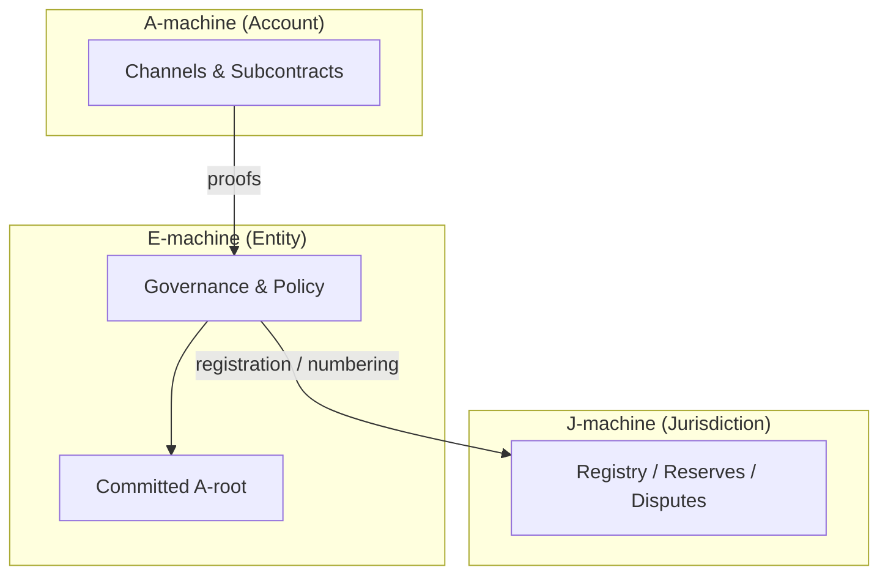
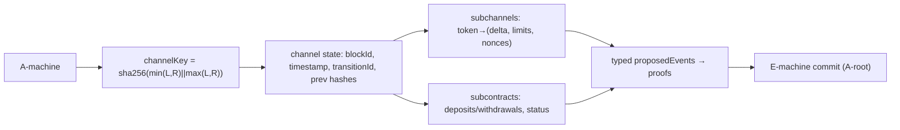
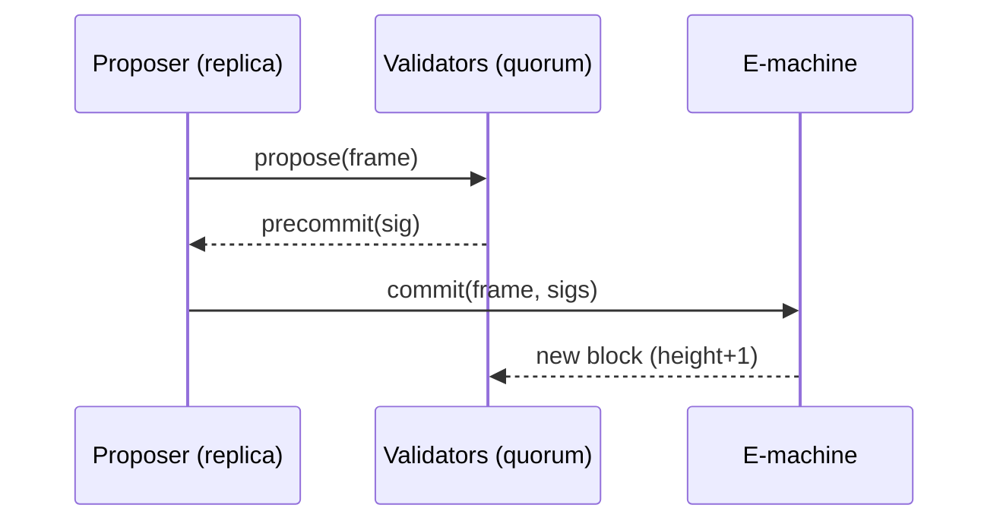

# XLN: Xtensible Layered Network

XLN is not a rollup or another L2. It is a machine language for sovereign economic agents: each Entity is a state-time machine with its own blocks, quorum, and storage. There is **no single global ledger**; instead, every Jurisdiction/Entity/Account maintains its own append-only ledger and interops via signed messages.

## At a glance (J/E/A machines)

- **J-machine**: Public registry of entities, reserves, and dispute outcomes. Optional anchoring layer for registered entities across chains.
- **E-machine**: Governance and policy for an organization. Quorum signs proposals to commit actions and anchor account roots.
- **A-machine**: Channels and subcontracts for users and apps. Emits proofs that E-machines sign and commit.

### Diagram: Layered architecture



## Key Concepts

1. **JEA**: Jurisdiction → Entity → Account hierarchy. Jurisdiction handles reserves and disputes, Entities encode governance, Accounts run channels/subcontracts.
2. **State-time machines (per-machine ledgers)**: Each machine maintains an append-only, signed block history. Machines interoperate through inbox/outbox semantics; there is no requirement for a single chain-wide consensus.
3. **Personal consensus**: Each machine advances when its quorum signs; determinism and replayability by design.
4. **Hanko governance**: Entities are signature schemes. Create "lazy entities" at 0 gas; use registered entities for on-chain anchoring and BCD separation (Board/Control/Dividend).
5. **DeFi integration**: A single hierarchical Hanko proof can authorize complex cross-protocol treasury actions.

We refer to these as J/E/A machines: a Jurisdiction machine (J-machine), an Entity machine (E-machine), and an Account machine (A-machine).

## Machines in XLN (J/E/A)

- **J-machine**: Public registry/observer of entities, reserves, and dispute outcomes; maintains a verifiable ledger of registrations and collateral events for anchoring registered E-machines.
- **E-machine**: Governance/policy machine for an organization. Proposals, votes, and finalized actions are committed block-by-block by the entity’s quorum.
- **A-machine (account/channel)**: Channel and subcontract state for users; bilateral or nested machines that emit proofs which E-machines sign and commit.

These ledgers are sovereign and composable. Interactions are mediated by signatures, not by a global sequencer.

## Account Layer (generalized)

- **Channels (bilateral A-ledgers)**: Deterministic, bilateral machines replicated at both sides. Each channel has a stable `channelKey = sha256(min(addrL,addrR) || max(addrL,addrR))`. State includes `blockId`, `timestamp`, `transitionId`, `previousBlockHash`, `previousStateHash`.
- **Subchannels & deltas**: Each channel holds many subchannels with token-specific deltas and limits:
  - `leftCreditLimit/rightCreditLimit`, `leftAllowence/rightAllowence`, `collateral`, `ondelta/offdelta`, `cooperativeNonce`, `disputeNonce`.
  - `proposedEvents` are typed intents (e.g., settle, withdraw) that become proofs for the Entity to sign and commit.
- **Subcontracts**: Embedded contract-like records per token/chain, tracking deposits/withdrawals (`leftDeposit/rightDeposit`, `leftWithdraw/rightWithdraw`) and `status` (active/closing/closed).
- **Proof encoding**: Channel state is RLP-encoded and stored under `channelMap[channelKey]`; the channel root is committed in the Entity’s final block, anchoring the A-ledger into the E-ledger.
- **Counters and safety**: `pendingSignatures`, `sendCounter/receiveCounter`, `rollbacks`, and nonces coordinate cooperative vs dispute flows.
- **Determinism**: All channel/account state commits via RLP+Merkle with per-machine signatures, enabling replay, audit, and fast recovery.

### Diagram: Account/channel structure



## Quick Start

### Run the server
```bash
bun run src/server.ts
```

Optional flags: set `NO_DEMO=1` to skip the demo.

### Explore docs
- `docs/README.md` — architecture from ground to sky
- `docs/memo-to-model.md` — tone, positioning, and summary guide
- `docs/hanko-architecture.md` — hierarchical signatures and integration
- `docs/contract-architecture.md` — smart contract split and decisions

## Why XLN vs L2/Rollups

- **No single global DA/consensus**: Per-machine ledgers remove sequencer risk and DA bottlenecks.
- **Zero-marginal-cost hierarchy**: Hanko enables infinite committees/sub-DAOs at 0 gas.
- **Institutional governance**: BCD separation maps to real corporate control/economics.

## Security & Invariants

- Deterministic, signed blocks per machine (replayable).
- Quorum thresholds enforced for progression.
- RLP+Merkle snapshots persisted to LevelDB; batch writes for safety.

### Diagram: Entity quorum flow



## Visual Demo

Run the deterministic demo:

```bash
bun run src/server.ts
```

You should see output like:

```text
🎯 === FINAL VERIFICATION ===
🔍 Consensus: ✅ SUCCESS (messages: ✅, proposals: ✅)
📊 Entity #1: 10 messages, 0 proposals, height 3
📊 Entity #2: proposals pending (gossip mode)
📸 Snapshot captured: "Tick 59: ..."
```

On-chain registration will attempt via local RPCs; if none are running you’ll see connection errors, which is expected for offline runs.

## Glossary

- **Precommit**: Validator signature over a proposed frame.
- **Frame**: Deterministic batch of actions to be committed as a block.
- **A-root**: Merkle root of A-machine state recorded by an E-machine block.
- **Hanko**: Hierarchical signature scheme treating entities as signature programs.

## Tagline options

- Build your own jurisdiction.
- The machine is the new nation.
- Not a protocol. A constitution.
