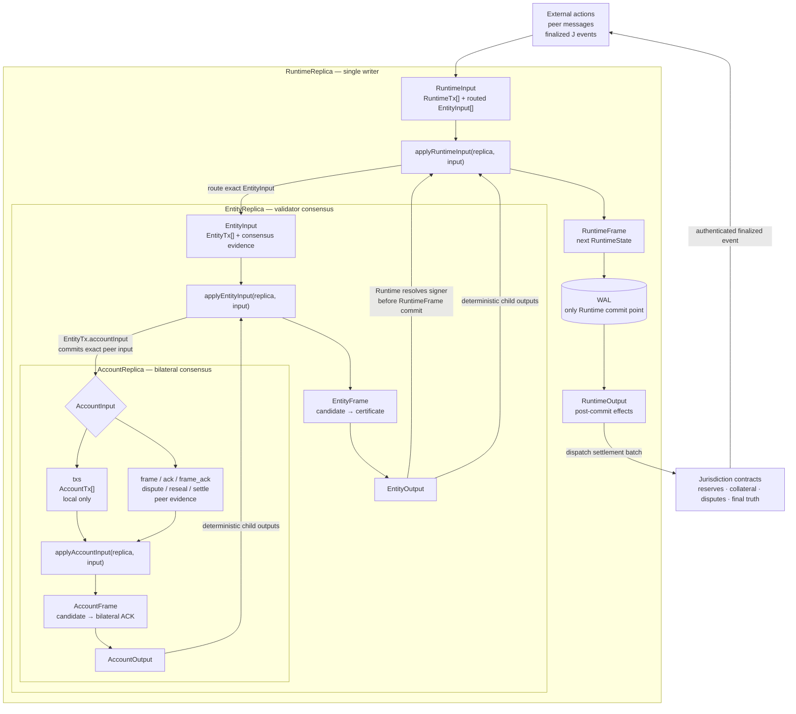

# xln — Cross-Local Network


**Instant off-chain settlement with on-chain finality.**

Byzantine consensus meets Bloomberg Terminal meets VR. Run complete economic simulations in your browser—no backend needed.

---

## Repository map

```
xln/
├── runtime/
│   ├── runtime/        Runtime input, frame, WAL boundary, and output routing
│   ├── entity/         Entity transactions, candidates, and Hanko consensus
│   ├── account/        Bilateral consensus and all financial mutation
│   ├── jurisdiction/
│   │   ├── machine/    Deterministic settlement protocol and event facts
│   │   └── adapter/    External chain observation and submission
│   ├── storage/        WAL, current state, history views, and recovery
│   ├── network/
│   │   ├── p2p/        Runtime-to-Runtime transport
│   │   └── relay/      Discovery and market relay services
│   ├── api/
│   │   ├── public/     Stable typed Runtime surface
│   │   ├── server/     HTTP/WebSocket delivery
│   │   └── runtime-adapter/  Frontend queries and commands
│   └── orchestrator/   Process startup and service composition
├── jurisdictions/      Solidity settlement and dispute contracts
├── frontend/           xln.finance client; display and input only
├── tests/              Browser and full-stack E2E evidence
├── docs/               Live protocol specifications and audit guides
├── scripts/            Build, release, audit-context, and operator tools
└── .archive/           Historical implementations; never current authority
```

`runtime/runtime.ts` is intentionally a narrow public facade. Core behavior belongs to
the owning Runtime, Entity, or Account folder; physical I/O stays outside those
state-machine folders.

---

## Audited module ledger

This ledger is the repository map plus its machine-readable audit state. Scores
come from `bun tools/audit.ts status`, not from agent opinions. `*` means that
the registry-derived score is backed only by evidence from an older source
fingerprint; `N/A` means support, history, generated state, or an audit scope
that does not yet have a canonical owner. A low score therefore means
**insufficient current evidence**, not an invented judgement about code style.

### Root folders

| Path | Purpose | Quality /1000 | Current audit note |
|---|---|---:|---|
| `.agents/` | Local agent handoffs and working ledgers. | N/A | Process metadata, not production. |
| `.archive/` | Historical implementations and references. | N/A | Never current protocol authority. |
| `.claude/` | Claude profiles and launch configuration. | N/A | Development tooling. |
| `.github/` | CI, deployment, and distribution workflows. | `0*` | Release/supply-chain evidence must be refreshed. |
| `.obsidian/` | Documentation workspace settings. | N/A | Editor metadata. |
| `.vscode/` | Editor and debugger settings. | N/A | Editor metadata. |
| `agents/` | Canonical agent workflow and review templates. | N/A | Assurance process. |
| `ai/` | Voice and auxiliary AI utilities. | N/A | Outside the fintech core. |
| `audits/` | Registry, findings, reviews, and evidence receipts. | N/A | Source of audit truth; does not score itself. |
| `brainvault/` | Deterministic wallet derivation, CLI, and workers. | `400*` | Strong historical tests; current fingerprint needs receipts. |
| `custody/` | Node signer storage and withdrawal/custody service. | `400*` | API/auth/custody evidence is stale. |
| `debates/` | Standalone multi-model review experiment. | N/A | Auxiliary application. |
| `design/` | Product mockups and visual references. | N/A | Design evidence, not executable protocol. |
| `docs/` | Architecture, protocol, operations, and audit guides. | N/A | Specifications; release-sensitive subsets are gated elsewhere. |
| `frontend/` | User wallet and developer/diagnostic interfaces. | `0*` | User and developer surfaces are split below. |
| `jurisdictions/` | Solidity identity, reserves, settlement, and disputes. | `400*` | Contracts are owner-gated; evidence is stale. |
| `native/` | Desktop/mobile shells and platform security tests. | N/A | Registry ownership is not yet explicit. |
| `ops/` | Testnet policy and deployment configuration. | N/A | Registry ownership is not yet explicit. |
| `packages/` | Published CLI and `xlnfinance` packages. | N/A | Release surface lacks direct fingerprint ownership. |
| `prompts/` | Reusable audit and investigation prompts. | N/A | Review tooling. |
| `release/` | Release-channel metadata. | N/A | Release input, not directly fingerprinted. |
| `runtime/` | Deterministic R → E → A core and external boundaries. | `0*` | Conservative minimum; detailed split below. |
| `scripts/` | Build, deploy, release, and operator commands. | `0*` | Security-sensitive subsets need current release evidence. |
| `tests/` | Browser, integration, security, and release evidence. | N/A | Tests score the production modules they exercise. |
| `tools/` | Audit, frozen-core, snapshot, and repository gates. | `0*` | Release/supply-chain evidence must be refreshed. |
| `types/` | Local TypeScript declaration shims. | N/A | Compile support only. |

### Runtime subfolders

| Path | Purpose | Quality /1000 | Current audit note |
|---|---|---:|---|
| `runtime/runtime/` | Single-writer ingress, Runtime frames, WAL boundary, post-commit outputs. | `0*` | Runtime-pipeline evidence is stale. |
| `runtime/entity/` | Entity transactions, validator proposals, certification, and frames. | `400*` | Entity-consensus evidence is stale. |
| `runtime/account/` | Bilateral financial state, proposals, ACKs, proofs, and disputes. | `400*` | Account-consensus evidence is stale. |
| `runtime/storage/` | WAL, snapshots, history, Merkle integrity, and recovery. | `400*` | Recovery evidence is stale. |
| `runtime/network/` | Authenticated direct/relay P2P, reconnect, and backpressure. | `0*` | Transport evidence and findings need re-adjudication. |
| `runtime/orchestrator/` | Startup, service composition, health, and recovery ordering. | `0*` | Operations evidence is stale. |
| `runtime/api/` | Authenticated Runtime adapter, public API, HTTP, and WebSocket delivery. | `0*` | Conservative minimum across API/auth/public-wallet modules. |
| `runtime/jurisdiction/` | Deterministic chain-event machine and external adapters. | `400*` | Finality/ingress evidence is stale. |
| `runtime/hanko/` | Entity identity, boards, thresholds, and signatures. | `400*` | Shares governance assurance scope. |
| `runtime/protocol/` | Canonical codecs, proofs, crypto, payments, and shared rules. | `400*` | Protocol-primitives evidence is stale. |
| `runtime/types/` | Canonical Runtime, Entity, Account, and finance schemas. | `400*` | Deterministic schema surface. |
| `runtime/routing/` | Deterministic route and fee mathematics. | `400*` | Protocol-primitives evidence is stale. |
| `runtime/config/` | Validated configuration and deterministic boundaries. | `400*` | Runtime-platform evidence is stale. |
| `runtime/infra/` | Platform services, diagnostics, redaction, and process boundaries. | `400*` | Runtime-platform evidence is stale. |
| `runtime/orderbook/` | Order admission, matching, fills, and cancellation. | `400*` | Markets evidence is stale. |
| `runtime/extensions/` | Cross-J swaps, lending, rebalance, and finance extensions. | `400*` | Paired-flow evidence must be refreshed. |
| `runtime/presentation/` | Deterministic public read-model projection. | `0*` | Public-wallet evidence is stale. |
| `runtime/watchtower/` | Recovery material and dispute observation. | `400*` | Storage/recovery evidence is stale. |
| `runtime/qa/` | Runtime release checks and evidence probes. | `0*` | Assurance code mapped to release gates. |
| `runtime/scripts/` | Runtime build, verification, E2E, and release commands. | `0*` | Release evidence is stale. |
| `runtime/scenarios/` | Real deterministic integration scenarios. | N/A | Evidence producer. |
| `runtime/__tests__/` | Narrow and targeted regression suites. | N/A | Evidence producer. |

### Frontend product split

| Surface | Main paths | What it owns | Quality /1000 | Current audit note |
|---|---|---|---:|---|
| User wallet | `components/Entity/`, `components/Wallet/`, `Views/RuntimeCreation.svelte`, `PaymentSpotlight.svelte`, `/app`, `/address`, `/testnet` | Registration, recovery, accounts, receive, payment, swap, lending, and durable status. | `0*` | Wallet and registration-to-payment evidence is stale. |
| Developer panels | `components/QA/`, `Tools/`, `Runtime/`, `TimeMachine/`, `lib/network3d/`, `/admin`, `/qa`, `/runs`, `/scenarios`, `/rpc*` | Runtime inspection, Graph3D, QA playback, raw RPC, and operator controls. | N/A | Deliberately peripheral; no canonical audit owner yet. |
| Shared client | `stores/`, `security/`, `native/`, navigation, and common UI | Runtime connection, command journal, sessions, and client security boundaries. | N/A | Cross-cutting ownership must be made explicit before scoring. |
| Mobile shells | `frontend/android/`, `frontend/ios/` | Capacitor packaging for mobile clients. | N/A | Release fingerprint ownership is not yet explicit. |

### Current total

| Canonical scope | Coverage /1000 | Quality /1000 | Evidence | Required target |
|---|---:|---:|---|---:|
| **17 criticality-weighted modules** | **0** | **244** | **0 current / 33 stale** | **≥990 per module** |

Re-run `bun tools/audit.ts status` for the active source fingerprint after each
merged candidate. Agent usefulness ratings are intentionally excluded from
module quality, and an unowned folder stays `N/A` instead of receiving a
fabricated score.

---

## 🚀 Quick Start

```bash
# Install + start everything
bun run dev

# Open browser
open http://localhost:8080
```

**First run:** ~2-3min (installs Foundry)
**After:** ~10sec

---

## 🎯 What is xln?

Cross-Local Network enables entities to:
- Exchange value **instantly off-chain** (BFT consensus)
- Anchor final state **on-chain** (Ethereum, Polygon, Arbitrum)
- Run complete **economic simulations in browser** (BrowserVM - no backend!)
- Visualize in **VR** (Quest/Vision Pro compatible)

**Think:** Lightning Network + Byzantine consensus + Bloomberg Terminal + Blender.

### Finance is physics of trust

---

## 🏗️ Architecture: nested R → E → A replicas

xln is three deterministic state machines nested inside one another. The
fourth layer, Jurisdiction, is the on-chain settlement boundary.

```text
EXTERNAL WORLD
  │ actions / peer messages / finalized J events
  ▼
┌──────────────────────────── RuntimeReplica ─────────────────────────────┐
│ RuntimeInput[RuntimeTx, routed EntityInput]                             │
│   applyRuntimeInput → RuntimeFrame → WAL commit                         │
│                                                                        │
│   ┌──────────────────────── EntityReplica ──────────────────────────┐   │
│   │ EntityInput[EntityTx, proposal, precommit, certificate]         │   │
│   │   applyEntityInput → EntityFrame → EntityOutput                 │   │
│   │                                                                 │   │
│   │   ┌────────────────── AccountReplica ────────────────────────┐   │   │
│   │   │ AccountInput                                             │   │   │
│   │   │   ├─ txs[AccountTx]                    local admission   │   │   │
│   │   │   └─ frame/ack/dispute/...              peer consensus  │   │   │
│   │   │   applyAccountInput → AccountFrame → AccountOutput       │   │   │
│   │   └───────────────────────────────────────────────────────────┘   │   │
│   └─────────────────────────────────────────────────────────────────┘   │
│                                                                        │
│ RuntimeOutput → dispatch only after WAL                               │
└────────────────────────────────────────────────────────────────────────┘
  │ settlement batches                              ▲ finalized events
  ▼                                                 │
┌──────────────────────── Jurisdiction ──────────────────────────────────┐
│ Depository contracts: reserves, collateral, disputes and final truth  │
└────────────────────────────────────────────────────────────────────────┘
```

The same vocabulary repeats at every off-chain layer:

| Layer | Live instance | Committed data | Entry | Requested change | Commitment | Result |
|---|---|---|---|---|---|---|
| Runtime | `RuntimeReplica` | `RuntimeState` | `RuntimeInput` | `RuntimeTx` | `RuntimeFrame` | `RuntimeOutput` |
| Entity | `EntityReplica` | `EntityState` | `EntityInput` | `EntityTx` | `EntityFrame` | `EntityOutput` |
| Account | `AccountReplica` | `AccountState` | `AccountInput` | `AccountTx` | `AccountFrame` | `AccountOutput` |

`*Replica` is a live instance. `*State` is only the deterministic data
committed by a frame. `*Machine` names transition logic, never a data type.

An application `EntityOutput` certifies only its destination Entity and exact
payload. It does not certify validator topology. Runtime resolves that output
to an exact signer replica, records the routed `EntityInput` in its candidate
frame, commits WAL, and only then permits delivery. Validator-to-validator
consensus messages may already name their exact signer.


```mermaid
flowchart TB
  EXT["External actions<br/>peer messages<br/>finalized J events"]

  subgraph R["RuntimeReplica — single writer"]
    RI["RuntimeInput<br/>RuntimeTx[] + routed EntityInput[]"]
    AR["applyRuntimeInput(replica, input)"]
    RF["RuntimeFrame<br/>next RuntimeState"]
    WAL[("WAL<br/>only Runtime commit point")]
    RO["RuntimeOutput<br/>post-commit effects"]
    RI --> AR --> RF --> WAL --> RO

    subgraph E["EntityReplica — validator consensus"]
      EI["EntityInput<br/>EntityTx[] + consensus evidence"]
      AE["applyEntityInput(replica, input)"]
      EF["EntityFrame<br/>candidate → certificate"]
      EO["EntityOutput"]
      EI --> AE --> EF --> EO

      subgraph A["AccountReplica — bilateral consensus"]
        AI{"AccountInput"}
        AT["txs<br/>AccountTx[]<br/>local only"]
        AP["frame / ack / frame_ack<br/>dispute / reseal / settle<br/>peer evidence"]
        AA["applyAccountInput(replica, input)"]
        AF["AccountFrame<br/>candidate → bilateral ACK"]
        AO["AccountOutput"]
        AI --> AT --> AA
        AI --> AP --> AA
        AA --> AF --> AO
      end
    end
  end

  J["Jurisdiction contracts<br/>reserves · collateral · disputes · final truth"]

  EXT --> RI
  EO -- "Runtime resolves signer<br/>before RuntimeFrame commit" --> AR
  AR -- "route exact EntityInput" --> EI
  AE -- "EntityTx.accountInput<br/>commits exact peer input" --> AI
  EO -- "deterministic child outputs" --> AR
  AO -- "deterministic child outputs" --> AE
  RO -- "dispatch settlement batch" --> J
  J -- "authenticated finalized event" --> EXT
```

### The transition law

```text
(previous replica, input) → { next replica, outputs }
```

- An input controls exactly one replica and contains that layer's transactions
  plus any consensus evidence.
- `EntityTx.accountInput` is the parent wrapper that commits the exact child
  `AccountPeerInput` inside the Entity frame. Entity-owned financial txs create
  the local `AccountInput.txs` branch without exposing it to P2P.
- Every Account path enters `applyAccountInput`: local `txs` builds a future
  Account frame; peer variants advance bilateral consensus.
- Outputs move upward as deterministic data. External I/O starts only after
  the enclosing Runtime frame is durable.
- Runtime has one writer and WAL; Entity keeps a candidate until validator
  certification; Account keeps a candidate until bilateral ACK.

The detailed protocol guide is
[Runtime → Entity → Account → Jurisdiction](docs/core/rjea-architecture.md).

---

## 💻 Key Commands

```bash
# Development
bun run dev              # Full stack (jurisdictions + runtime + frontend)
bun run check            # TypeScript + Svelte validation
bun run build            # Build runtime.js for browser

# Jurisdictions (Contracts)
bun run env:build        # Compile Solidity

# Frontend
cd frontend && bun run dev      # Vite dev server
cd frontend && bun run build    # Production build

# Testing
bun run test:e2e          # Fast E2E: 8 core scenarios in parallel
bun run test:e2e:fast     # Same fast bar, explicit name
bun run test:e2e:full     # Full E2E: every tests/e2e*.spec.ts target
bun run test:e2e:parallel:isolated  # Raw isolated E2E runner for custom targets

# Production-scale runtime adapter benchmarks
bun run bench:radapter:hub1m         # 1M saved hub accounts, 1% hot set, real /rpc WebSocket
bun run bench:radapter:hub1m:allmem  # Same, but materialize all 1M accounts into runtime memory
```

---

## 🎨 XLNView Panel System

**Bloomberg Terminal-style workspace. Drag, dock, float, tab - full Chrome DevTools UX.**

### Core 4 Panels (Open by Default)
1. **🌐 Graph3D** - Force-directed network viz (WebGL/WebGPU toggle)
2. **🏢 Entities** - Live entity list (reserves, accounts, activity)
3. **💰 Depository** - On-chain J-state viewer (BrowserVM queries)
4. **🎬 Architect** - God-mode controls (5 modes: Explore/Build/Economy/Governance/Resolve)

### Layouts
- **Default**: 4-panel workspace
- **Analyst**: Graph3D + Depository + Console (research mode)
- **Builder**: Architect + Graph3D + Entities (creation mode)
- **Embed**: Graph3D only (for docs/blog posts)

**Tech:** Dockview (2.8k stars), Svelte reactivity, localStorage persistence

**Source:** `frontend/src/lib/view/` and `frontend/src/lib/components/`

---

## 🧪 Simnet (Offline Blockchain in Browser)

**No localhost:8545. No cloud RPC. Pure browser.**

- **Engine:** @ethereumjs/vm v10 (official Ethereum Foundation implementation)
- **Deployed:** Depository.sol + 500 prefunded entities
- **Tokens:** USDC (id=1), ETH (id=2)
- **Reset:** Refresh page = new universe
- **Persistent:** Optional IndexedDB (resume sessions)

**Implementation:** `runtime/jurisdiction/adapter/browservm/browservm.ts` and its focused
`browservm-*` modules

**Demo:** Load any scenario (AHB, Grid) - BrowserVM deploys contracts automatically

---

## 🎮 VR/Quest Support

- **WebXR:** Enabled by default (WebGL renderer)
- **Offline:** Simnet works without network (perfect for VR demos)
- **Performance:** 72fps in Quest 3
- **Future:** Hand tracking, voice commands, spatial UI

---

## Auditor reading path

The shortest reliable path from protocol vocabulary to one committed unit of
value is:

1. [R → E → A → J architecture](docs/core/rjea-architecture.md)
2. [Payment and HTLC flow](docs/implementation/payment-spec.md)
3. `runtime/runtime/frame/process.ts` — Runtime transition and WAL ordering
4. `runtime/entity/consensus/input-consensus.ts` — Entity entry point
5. `runtime/account/consensus/index.ts` — Account entry point and collision
6. `runtime/account/tx/apply.ts` — financial validation
7. `runtime/account/tx/mutation.ts` — financial mutation
8. `runtime/storage/commit.ts` — the only durable Runtime commit point

Then read [the documentation index](docs/readme.md), [active release
blockers](todo.md), and [the mainnet acceptance bar](docs/mainnet.md). Files
under `docs/archive/` and `docs/releases/` are historical evidence, never
current protocol authority.

---

## 🔥 Recent Updates (`0.1.5` - May 2026)

- ✅ **Official watchtower** - Same-origin `/api/tower/*`, standalone daemon, scheduled sweep, and no public `/api/watchtower/*` sweep exposure
- ✅ **Encrypted recovery** - Tower backup bundles and delayed-last-resort remedies are encrypted; plaintext last-resort remedies are rejected
- ✅ **Recovery E2E** - Wiped-browser tower restore and post-restore channel payments are covered by browser tests
- ✅ **Prod health** - Market maker/reset recovery and prod payment smoke passed in the `0.1.5` release pass
- ✅ **Planning cleanup** - Live TODO/NEXT work is consolidated into [todo.md](todo.md)

---

## 🛠️ Tech Stack

**Runtime:** TypeScript + Bun
**Frontend:** Svelte + Vite + Three.js
**Contracts:** Solidity + Hardhat
**Blockchain:** @ethereumjs/vm (simnet) → Hardhat (local) → Ethereum/L2s (prod)
**Panels:** Dockview (2.8k⭐)
**Tests:** Playwright

---

## 🗺️ Network Roadmap

The current release line is production-demo/public-testnet grade, not
mainnet-ready. The active blocker order is in [todo.md](todo.md), current
status is in [docs/status.md](docs/status.md), and the real-user-fund bar is in
[docs/mainnet.md](docs/mainnet.md).

Current focus:

- keep local and prod-like E2E green for payments, swaps, disputes, recovery,
  and watchtower action;
- finish Peer State Refresh and account-level recovery coverage UX;
- run release-duration soak/gates before any mainnet-candidate claim;
- make chain/RPC, operator keys, tower gas policy, and monitoring explicit;
- prepare external audit material before real funds.

---

## 📖 Learn More

**Start here:**
1. [docs/readme.md](docs/readme.md) - Documentation index
2. [todo.md](todo.md) - Active TODO/NEXT backlog
3. [docs/status.md](docs/status.md) - Current launch state
4. [docs/mainnet.md](docs/mainnet.md) - Mainnet release bar
5. [docs/recovery-watchtower-protocol.md](docs/recovery-watchtower-protocol.md) - Recovery and watchtower protocol

**For deep dives:** [docs/readme.md](docs/readme.md)

---

**License:** AGPL-3.0
**Status:** Active development, pre-mainnet `0.1.5`
**Website:** https://xln.finance
